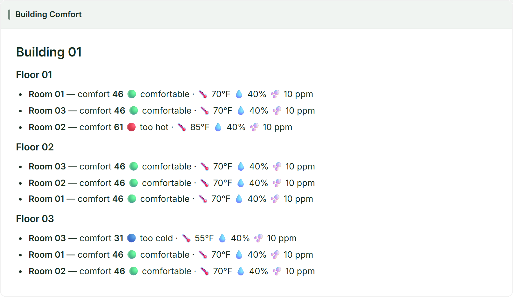

Imagine you manage a building and want to know — the instant it happens — when any room becomes uncomfortable: too hot, too cold, or stuffy with CO2. You don't want to poll sensors on a timer or wire up a stream processor by hand. You just want to describe what "uncomfortable" means and have something watch every room, floor, and the whole building for you, continuously.

This tutorial builds a **Building Comfort** monitoring demo on **Drasi Server**. A PostgreSQL database holds a building made of floors and rooms, each room reporting `temperature`, `humidity`, and `co2`. You'll start Drasi Server with a single configuration, watch a live dashboard light up, and then change room readings and see everything react in real time — without writing any application code, and **without building a bespoke web UI**. Instead of a hand-written dashboard, the demo uses Drasi Server's built-in **dashboard reaction**.

**What you'll build:** a running Drasi Server that connects to PostgreSQL and reacts to room sensor changes in real time, assembled from Drasi's three core building blocks:

<div class="flow-diagram">
  <div class="flow-step">
    <div class="flow-step__icon">
      <i class="fas fa-database"></i>
    </div>
    <div class="flow-step__label">Sources</div>
    <div class="flow-step__description">Connect to your data sources</div>
  </div>

  <div class="flow-arrow">
    <i class="fas fa-arrow-right"></i>
  </div>

  <div class="flow-step">
    <div class="flow-step__icon">
      <i class="fas fa-filter"></i>
    </div>
    <div class="flow-step__label">Continuous Queries</div>
    <div class="flow-step__description">Define what changes matter</div>
  </div>

  <div class="flow-arrow">
    <i class="fas fa-arrow-right"></i>
  </div>

  <div class="flow-step">
    <div class="flow-step__icon">
      <i class="fas fa-bolt"></i>
    </div>
    <div class="flow-step__label">Reactions</div>
    <div class="flow-step__description">Take action automatically</div>
  </div>
</div>

| Step | What You'll Do | Time |
| ---- | ------------- | ---- |
| **[Step 1: Set Up Your Environment](#setup)** | Open the dev container (or install Drasi Server locally) | 5 min |
| **[Step 2: Run the Demo](#run)** | One command starts PostgreSQL and Drasi Server | 3 min |
| **[Step 3: Open the Dashboard](#dashboard)** | Watch comfort levels and alerts live | 2 min |
| **[Step 4: Drive Change](#drive)** | Break, reset, and simulate rooms — and watch Drasi react instantly | 5 min |
| **[How It Works](#how)** | Understand the source, the six queries, the synthetic joins, and the dashboard | 5 min |

{}
- **Terminals:** you'll use two. **Terminal 1** runs the demo (it stays in the foreground). Use **Terminal 2** for the helper scripts that change data.
- **Working directory:** run every command from the tutorial directory (`tutorials/building-comfort/`). The dev container opens there automatically; if you're running locally, `cd tutorials/building-comfort` first.
- **Command tabs:** commands are shown in tabs (*bash / zsh* and *PowerShell*) — use the one for your shell. The dev container and Codespaces use *bash*.
- **Ports:** the Drasi Server API is on `8380`, the dashboard is on `3000`, and PostgreSQL is published on `5732`.
{}

## Step 1 of 4: Set Up Your Environment {#setup}

The easiest way to follow this tutorial is the **dev container**, which installs everything for you. You can also run locally if you prefer.

### Option A: Dev Container or GitHub Codespaces (recommended)

1. Open this repository in VS Code and run **Reopen in Container** (or create a **Codespace** from the repo's **Code** menu).
2. When prompted for a configuration, choose **Drasi Server - Building Comfort Tutorial**.
3. Wait for the container to finish. Its setup script downloads the Drasi Server binary and installs the PostgreSQL client.

That's it — skip ahead to [Step 2](#run).

### Option B: Run Locally

You'll need **Docker** (for PostgreSQL) and **bash** (the helper scripts use it; on Windows use Git Bash or WSL). From the repository root, move into the tutorial directory and download the Drasi Server binary:



cd tutorials/building-comfort
bash scripts/download.sh


cd tutorials/building-comfort
powershell -ExecutionPolicy Bypass -File scripts/download.ps1



This places the binary at `bin/drasi-server` (or `bin\drasi-server.exe` on Windows) inside the tutorial directory.

## Step 2 of 4: Run the Demo {#run}

Everything runs from a single configuration file, `server-config.yaml`. In **Terminal 1**, start the demo:



bash scripts/start-demo.sh


powershell -ExecutionPolicy Bypass -File scripts/start-demo.ps1



The `start-demo` script does two things: it starts PostgreSQL (seeding one building, three floors, and nine rooms — every room comfortable to begin with) and then runs Drasi Server in the foreground.

On first start, Drasi Server downloads the plugins it needs (`source/postgres`, `bootstrap/postgres`, `reaction/dashboard`, `reaction/log`) from `ghcr.io/drasi-project` and caches them under `~/.drasi/plugins`, connects to the database, and starts the six continuous queries and the dashboard. When you see a line like the following, it's ready:

```text
Drasi Server started successfully with API on port 8380
```

Leave this running. Everything else happens from **Terminal 2** (or your browser).

{}
Press **Ctrl+C** in Terminal 1 to stop the server. To remove the database container when you're completely done, run `bash scripts/cleanup.sh` (bash) or `powershell -ExecutionPolicy Bypass -File scripts/cleanup.ps1` (PowerShell). Add `--volumes` (bash) or `-RemoveVolumes` (PowerShell) to also delete the data.
{}

## Step 3 of 4: Open the Dashboard {#dashboard}

Drasi Server's dashboard reaction hosts a live web dashboard — there's no separate app to build or run. **Wait until Terminal 1 prints `Drasi Server started successfully`** (on the first run this takes ~30 seconds while the plugins download), then open it in your browser:

```text
http://localhost:3000
```

In the dev container or Codespaces, port `3000` is forwarded automatically — VS Code shows a notification when the dashboard is ready, and you can also open it from the **Ports** panel (the **Comfort Dashboard** entry). If you open the page before the server has finished starting, just refresh once it's ready.

You'll see the **Building Comfort** dashboard:

- **Building Comfort** (the large panel) — the building grouped by floor, with each room's comfort level and sensor readings. Every room starts at comfort `46` (comfortable).
- **Building Comfort** KPI and **gauge** — the building's overall comfort level.
- **Comfort Alerts** and **Floor Alerts** — empty for now; rooms and floors appear here only when they need attention.
- **Floor Comfort** — a table of each floor's comfort level.

The dashboard updates the instant the data changes — no refreshing. Let's make something change.

## Step 4 of 4: Drive Change {#drive}

With Terminal 1 running the demo and the dashboard open, use **Terminal 2** to change room readings and watch Drasi react.

{}
The helper scripts below don't talk to Drasi Server at all. Each one runs a plain SQL `UPDATE` against PostgreSQL — exactly what an existing building-management app would already do. There's no API to call, no event to publish, and no application code in the loop. Drasi observes the row change through PostgreSQL's logical replication (CDC), re-evaluates the affected queries, and updates the dashboard on its own. The **PowerShell** tabs make this obvious — they're just raw `psql` `UPDATE` statements, and the **bash** scripts wrap the same SQL.
{}

### Break a room

Push a single room out of the comfortable band (sets `temperature = 40`, `humidity = 20`, `co2 = 700`):



bash scripts/break-room.sh room_01_01_01


docker exec building-comfort-postgres psql -U drasi_user -d building_comfort -c "UPDATE \"Room\" SET temperature=40, humidity=20, co2=700 WHERE id='room_01_01_01';"



Within about a second the dashboard reacts: **Room 01** on **Floor 01** drops out of the comfortable band, the building gauge falls, and entries appear in **Comfort Alerts** and **Floor Alerts**. The server console (Terminal 1) logs the alerts too.

### Reset a room (or all rooms)

Return a room — or the whole building — to comfortable defaults (`70 / 40 / 10`):



# Reset one room
bash scripts/reset-room.sh room_01_01_01

# Reset every room
bash scripts/reset-room.sh


docker exec building-comfort-postgres psql -U drasi_user -d building_comfort -c "UPDATE \"Room\" SET temperature=70, humidity=40, co2=10 WHERE id='room_01_01_01';"



The alerts clear and the building returns to green.

### Set custom values

Try partial degradation — make a room too hot without touching CO2:



# set-room.sh <room_id> <temperature> <humidity> <co2>
bash scripts/set-room.sh room_01_02_03 82 40 10


docker exec building-comfort-postgres psql -U drasi_user -d building_comfort -c "UPDATE \"Room\" SET temperature=82, humidity=40, co2=10 WHERE id='room_01_02_03';"



That gives `50 + (82-72) + (40-42) + 0 = 58` — above 50, so the room and its floor raise alerts even though humidity and CO2 are fine.

### Let it run hands-free

To keep the dashboard alive without typing, run the simulator. It picks a random room every few seconds and assigns new readings, so comfort levels rise and fall and alerts come and go on their own:



bash scripts/simulate.sh


# The simulator is a bash script; run it from Git Bash or WSL:
bash scripts/simulate.sh



Press **Ctrl+C** to stop the simulator, then `reset-room.sh` to return everything to comfortable.

## How It Works {#how}

Everything you just ran is described by the single `server-config.yaml`. Here's what each part does.

### The Source

```yaml
sources:
  - kind: postgres
    id: building-facilities
    autoStart: true

    # Connection (supplied via environment variables, with defaults)
    host: "${POSTGRES_HOST:-localhost}"
    port: ${POSTGRES_PORT:-5732}
    database: "${POSTGRES_DATABASE:-building_comfort}"
    user: "${POSTGRES_USER:-drasi_user}"
    password: "${POSTGRES_PASSWORD:-drasi_password}"
    sslMode: prefer

    # Tables to monitor (PascalCase so node labels match the queries)
    tables:
      - Building
      - Floor
      - Room

    # Logical replication slot + publication
    slotName: drasi_building_comfort_slot
    publicationName: drasi_building_comfort_pub

    # Primary key of each table, so Drasi can track row identity
    tableKeys:
      - table: Building
        keyColumns:
          - id
      - table: Floor
        keyColumns:
          - id
      - table: Room
        keyColumns:
          - id

    # Load the rows that already exist when the server starts
    bootstrapProvider:
      kind: postgres
```

The PostgreSQL source connects with the credentials above (provided via environment variables, with sensible defaults) and uses **logical replication (CDC)** to stream changes from the `Building`, `Floor`, and `Room` tables. `tableKeys` tells Drasi the primary key of each table so it can track row identity across changes. The bootstrap provider loads the rows that already exist when the server starts; after that, every `UPDATE` you make (via the helper scripts) flows to Drasi as a change. The table names are quoted and PascalCase so the node labels Drasi sees match the queries exactly: `(r:Room)`, `(f:Floor)`, `(b:Building)`. For every option the source accepts, see [Configure the PostgreSQL Source](https://drasi.io/drasi-server/how-to-guides/configuration/configure-sources/configure-postgresql-source/).

### The Continuous Queries

Each query computes a **comfort level** with the same formula. A value between **40 and 50** is comfortable; the seed values (70°F, 40%, 10 ppm) give `50 + (70-72) + (40-42) + 0 = 46`.

```cypher
floor( 50 + (r.temperature - 72) + (r.humidity - 42)
      + CASE WHEN r.co2 > 500 THEN (r.co2 - 500) / 25 ELSE 0 END )
```

There are six queries:

| Query | What it returns |
| ----- | --------------- |
| `building-comfort-ui` | One row per room with its comfort level — the feed that drives the dashboard view |
| `building-comfort-level-calc` | The building's overall comfort level |
| `floor-comfort-level-calc` | Each floor's average comfort level |
| `room-alert` | Only the rooms whose comfort is outside 40–50 |
| `floor-alert` | Only the floors whose average comfort is outside 40–50 |
| `building-alert` | The building, when its overall comfort is outside 40–50 |

#### Synthetic joins connect the entities

PostgreSQL knows `Room.floor_id` references `Floor.id` through a foreign key, but Drasi doesn't read foreign keys. Instead, each query **declares** the relationships it needs as synthetic joins, so the Cypher can walk from room to floor to building:

```yaml
sources:
  - sourceId: building-facilities
    nodes:
      - Room
      - Floor
      - Building
joins:
  - id: PART_OF_FLOOR
    keys:
      - label: Room
        property: floor_id
      - label: Floor
        property: id
  - id: PART_OF_BUILDING
    keys:
      - label: Floor
        property: building_id
      - label: Building
        property: id
```

With those joins declared, a query can match the whole hierarchy:

```cypher
MATCH (r:Room)-[:PART_OF_FLOOR]->(f:Floor)-[:PART_OF_BUILDING]->(b:Building)
```

#### Aggregating up the hierarchy

Half of the queries don't just read rooms — they **roll comfort levels up** the building. In a Continuous Query, an aggregate such as `avg()` inside a `WITH` groups by whatever non-aggregated values travel alongside it, exactly like SQL's `GROUP BY`.

**One stage — average a floor's rooms.** `floor-comfort-level-calc` keeps the floor `f` in the `WITH`, so `avg()` produces one value per floor:

```cypher
WITH f, floor( 50 + (r.temperature - 72) + ... ) AS RoomComfortLevel
WITH f, avg(RoomComfortLevel) AS ComfortLevel
RETURN f.id AS FloorId, ComfortLevel
```

**Two stages — average the averages.** `building-alert` aggregates twice. Carrying `f, b` groups the first `avg()` by floor; dropping `f` from the next `WITH` widens the grouping so the second `avg()` rolls the floor averages up into a single building level:

```cypher
WITH f, b, avg(RoomComfortLevel) AS FloorComfortLevel   // rooms  -> floor
WITH b,    avg(FloorComfortLevel) AS ComfortLevel        // floors -> building
```

**Filtering on an aggregate.** The `floor-alert` and `building-alert` queries place a `WHERE` *after* the aggregation — like SQL's `HAVING` — so a floor or the building only shows up while its average is outside the comfortable band:

```cypher
WITH f, avg(RoomComfortLevel) AS ComfortLevel
WHERE ComfortLevel < 40 OR ComfortLevel > 50
RETURN f.id AS FloorId, ComfortLevel
```

Because these are *continuous* queries, the aggregates are maintained **incrementally**: when one room's reading changes, Drasi recomputes only the affected floor and building averages and emits just that change — it never rescans every room.

### The Dashboard Reaction

```yaml
reactions:
  - kind: dashboard
    id: building-comfort-dashboard
    queries:
      - building-comfort-ui
      - building-comfort-level-calc
      # ...
    port: 3000
    predefinedDashboards:
      - id: building-comfort
        name: Building Comfort
        widgets:
          # ...
```

The dashboard reaction subscribes to the queries and streams their changes to the browser over a WebSocket. A **predefined dashboard** is seeded on startup, so the layout is ready the first time you open it. Most of the panels are **Markdown widgets** that use the reaction's Handlebars helpers (`groupBy`, `each`, `gt`/`lt`) to lay out the building from the `building-comfort-ui` rows, plus a KPI and gauge for the overall level and Markdown widgets for the alert lists. Because the queries only emit *changes*, the dashboard updates the instant a room's comfort changes — no polling. The full set of widget types and configuration options is documented in [Configure the Dashboard Reaction](https://drasi.io/drasi-server/how-to-guides/configuration/configure-reactions/configure-dashboard-reaction/).

For example, the centerpiece **Building Comfort** panel is a single Markdown widget. Its template groups the `building-comfort-ui` rows by floor with `groupBy`, loops the rooms with `each`, and uses the `gt`/`lt` helpers to pick a status emoji per comfort level. Here is the widget's `template`:

```handlebars
{{#groupBy rows "FloorName"}}
### {{@key}}
{{#each this}}
- **{{this.RoomName}}** — comfort **{{this.ComfortLevel}}**
    {{#if (gt this.ComfortLevel 50)}}
      🔴 too hot
    {{else}}
      {{#if (lt this.ComfortLevel 40)}}
        🔵 too cold
      {{else}}
        🟢 comfortable
      {{/if}}
    {{/if}}
    · 🌡️ {{this.Temperature}}°F  💧 {{this.Humidity}}%  🫧 {{this.CO2}} ppm
{{/each}}
{{/groupBy}}
```

And the reaction renders it live:



### Build a Custom UI with the SSE Reaction

Prefer to build your own front end? The dashboard reaction is the fastest way to *see* a query, but Drasi Server can drive a fully custom UI just as easily through the **SSE reaction** (`kind: sse`). It streams the same query changes to the browser over [Server-Sent Events](https://developer.mozilla.org/en-US/docs/Web/API/Server-sent_events), so any web app can subscribe with a few lines of JavaScript and render the results however you like:

```js
const events = new EventSource("http://localhost:8081/events");
events.onmessage = (e) => {
  const { queryId, results } = JSON.parse(e.data);
  // Each result carries `before` and `after`; update your UI from `after`.
  for (const change of results) render(queryId, change.after);
};
```

Because the reaction pushes only what *changed* — never the full result set — your UI stays live without polling, powered by the same engine behind this dashboard but with complete control over the markup. The [Getting Started tutorial](../getting-started/) wires up the SSE reaction step by step, and the [Configure the SSE Reaction](https://drasi.io/drasi-server/how-to-guides/configuration/configure-reactions/configure-sse-reaction/) guide documents its full configuration.

{}
You can also query Drasi Server's REST API while the demo runs — see `requests.http` for ready-made requests, for example:

```text
GET http://localhost:8380/api/v1/queries/building-comfort-ui/results
GET http://localhost:8380/api/v1/queries/room-alert/results
```
{}

## Clean Up {#cleanup}

When you're finished, stop Drasi Server with **Ctrl+C** in Terminal 1, then remove the database container:



# Stop containers, keep data
bash scripts/cleanup.sh

# Stop containers and delete the data volume
bash scripts/cleanup.sh --volumes


# Stop containers, keep data
powershell -ExecutionPolicy Bypass -File scripts/cleanup.ps1

# Stop containers and delete the data volume
powershell -ExecutionPolicy Bypass -File scripts/cleanup.ps1 -RemoveVolumes



## What You Learned {#summary}

- **Sources** connect Drasi Server to live data — here, PostgreSQL via Change Data Capture.
- **Continuous Queries** with **synthetic joins** let you model relationships (room → floor → building) and compute derived values (comfort levels) that stay current automatically.
- **Reactions** turn query changes into action. The **dashboard reaction** gave you a live, configurable UI with zero application code — no bespoke web app required.
- Because Drasi emits only what *changed*, everything updates the instant the data does, with no polling.

From here, try editing the comfort formula or the dashboard widgets in `server-config.yaml`, adding a new alert query, or pointing the dashboard at your own data.
