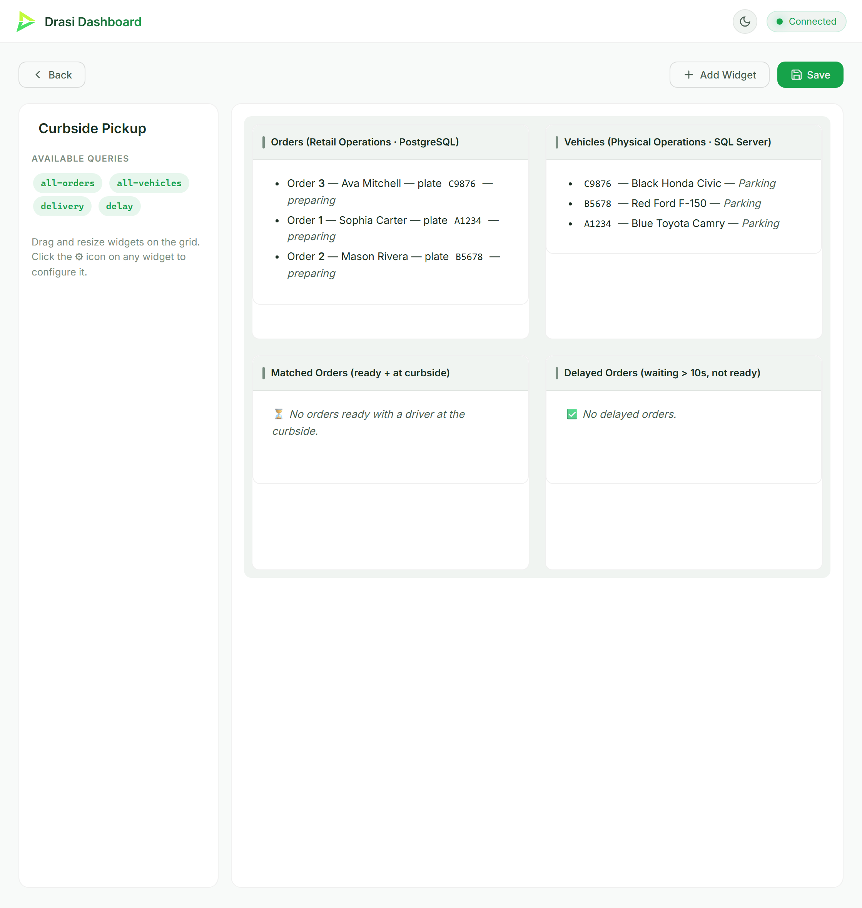

<!-- DO NOT EDIT. Generated from _index.md by scripts/render-tutorials.py. Edit _index.md and run `python3 scripts/render-tutorials.py`. -->

Imagine a store running curbside pickup. The **retail team** manages customer orders in one database and marks an order *ready* when it's prepared. Independently, the **physical operations team** tracks pickup vehicles in *another* database, and a driver sets their location to *Curbside* when they arrive. The two systems never talk to each other.

You want a single live dashboard with four panels:

- a **list of every order** and a **list of every vehicle**, straight from the two databases, plus the two situations that matter:
- a **Matched Orders** panel that lights up the instant an order is *ready* **and** its driver is at the curbside, so staff know exactly which order to carry out, and
- a **Delayed Orders** panel that flags drivers who have been waiting at the curbside too long while their order still isn't ready.

The catch: the orders live in **PostgreSQL** and the vehicles live in **Microsoft SQL Server**. Building this the traditional way means CDC pipelines, a stream processor, a websocket backend, and a custom front end. This tutorial builds it on **Drasi Server** instead: two sources, four continuous queries (two of which join across both databases), and the built-in **dashboard reaction** - **no application code and no bespoke web UI**. A small **terminal app** stands in for the two operations teams so you can drive the changes yourself and watch every SQL statement as it runs.

**Sources** → **Continuous Queries** → **Reactions**

- **Sources** — Connect to your data sources
- **Continuous Queries** — Define what changes matter
- **Reactions** — Take action automatically

| Step | What You'll Do |
| ---- | ------------- |
| **[Step 1: Set Up Your Environment](#step-1-of-4-set-up-your-environment)** | Open the dev container (or install the tools locally) |
| **[Step 2: Run the Demo](#step-2-of-4-run-the-demo)** | One command starts both databases and Drasi Server |
| **[Step 3: Open the Dashboard](#step-3-of-4-open-the-dashboard)** | Watch all four panels update live |
| **[Step 4: Drive Change](#step-4-of-4-drive-change)** | Use the terminal app to change orders and vehicles, and watch Drasi react |
| **[How It Works](#how-it-works)** | Understand the two sources, the cross-database join, and the four queries |

> **Before you begin**
>
> - **Terminals:** you'll use two. **Terminal 1** runs the demo (it stays in the foreground). **Terminal 2** runs the operations console you drive changes from.
> - **Working directory:** run every command from the tutorial directory (`tutorials/curbside-pickup/`). The dev container opens there automatically; if you're running locally, `cd tutorials/curbside-pickup` first.
> - **Command tabs:** commands are shown in tabs (*bash / zsh* and *PowerShell*). Use the one for your shell. The dev container and Codespaces use *bash*.
> - **Ports:** the Drasi Server API is on `8480`, the dashboard is on `3000`, PostgreSQL is published on `5742`, and SQL Server on `1435`.

## Step 1 of 4: Set Up Your Environment
This tutorial needs **Docker** (it runs PostgreSQL and SQL Server) and **Node.js 18+** (for the operations console). The easiest way to get everything is the **dev container**.

### Option A: Dev Container or GitHub Codespaces (recommended)

1. Open this repository in VS Code and run **Reopen in Container** (or create a **Codespace** from the repo's **Code** menu).
2. When prompted for a configuration, choose **Drasi Server - Curbside Pickup Tutorial**.
3. Wait for the container to finish. Its setup script downloads the Drasi Server binary and installs the console's dependencies.

That's it. Skip ahead to [Step 2](#step-2-of-4-run-the-demo).

### Option B: Run Locally

You'll need **Docker**, **Node.js 18+**, and **bash** (the helper scripts use it; on Windows use Git Bash or WSL, or use the PowerShell tabs). From the repository root, move into the tutorial directory and download the Drasi Server binary:

**bash / zsh**

```bash
cd tutorials/curbside-pickup
bash scripts/download.sh
```

**PowerShell**

```powershell
cd tutorials/curbside-pickup
powershell -ExecutionPolicy Bypass -File scripts/download.ps1
```

This places the binary at `bin/drasi-server` (or `bin\drasi-server.exe` on Windows) inside the tutorial directory.

## Step 2 of 4: Run the Demo
Everything runs from a single configuration file, `server-config.yaml`. In **Terminal 1**, start the demo:

**bash / zsh**

```bash
bash scripts/start-demo.sh
```

**PowerShell**

```powershell
powershell -ExecutionPolicy Bypass -File scripts/start-demo.ps1
```

The `start-demo` script does two things:

1. **Starts the databases.** PostgreSQL comes up with logical replication enabled and the `orders` table seeded (three orders, all *preparing*). SQL Server comes up with **Change Data Capture** enabled on the `vehicles` table (three vehicles, all *Parking*) - the plates match the orders.
2. **Runs Drasi Server** in the foreground with the full configuration.

On first start, Drasi Server downloads the plugins it needs (`source/postgres`, `bootstrap/postgres`, `source/mssql`, `bootstrap/mssql`, `reaction/dashboard`) from `ghcr.io/drasi-project` and caches them under `~/.drasi/plugins`, connects to both databases, bootstraps the existing rows, starts the four continuous queries, and starts the dashboard. When you see a line like the following, it's ready:

```text
Drasi Server started successfully with API on port 8480
```

Leave this running. Everything else happens from **Terminal 2** (or your browser).

> **Stopping and resetting**
>
> Press **Ctrl+C** in Terminal 1 to stop the server. To remove the database containers when you're completely done, run `bash scripts/cleanup.sh` (bash) or `powershell -ExecutionPolicy Bypass -File scripts/cleanup.ps1` (PowerShell). Add `--volumes` to also delete the database data.

## Step 3 of 4: Open the Dashboard
Drasi Server's dashboard reaction hosts the live dashboard; there's no separate app to build or run. **Wait until Terminal 1 prints `Drasi Server started successfully`** (the first run takes a little longer while the plugins download), then open it in your browser:

```text
http://localhost:3000
```

In the dev container or Codespaces, port `3000` is forwarded automatically. Open the seeded **Curbside Pickup** dashboard. It has four Markdown panels:

- **Orders** - every order in PostgreSQL, with its customer, plate, and status.
- **Vehicles** - every vehicle in SQL Server, with its make, model, color, and location.
- **Matched Orders** - orders that are *ready* whose driver is at the *Curbside* (the `delivery` query).
- **Delayed Orders** - drivers who have waited at the curbside for more than 10 seconds while their order is still being prepared (the `delay` query).

The **Orders** and **Vehicles** panels list all three rows from the moment the dashboard loads. The **Matched Orders** and **Delayed Orders** panels start **empty** - at bootstrap no order is *ready* and no vehicle is at the *Curbside* - and fill in as you drive changes. Every panel updates the instant the data changes, with no refreshing.



> **Known issue: the Vehicles list**
>
> Open the dashboard **before** driving changes - the Orders and Vehicles panels load the full list once and then apply each change live. With the current published dashboard reaction, moving a vehicle **adds** a second row for it (the bootstrapped row plus the live one) instead of updating in place, so a changed vehicle can appear twice in the Vehicles list. This is a dashboard-reaction bug ([drasi-core#605](https://github.com/drasi-project/drasi-core/issues/605)) and is independent of your data; the Orders, Matched, and Delayed panels are unaffected.

## Step 4 of 4: Drive Change
With Terminal 1 running the demo and the dashboard open, start the **operations console** in **Terminal 2**:

**bash / zsh**

```bash
bash scripts/start-tui.sh
```

**PowerShell**

```powershell
powershell -ExecutionPolicy Bypass -File scripts/start-tui.ps1
```

The console is a small terminal app with two panels - **Retail Operations** (the PostgreSQL `orders` table) on the left and **Physical Operations** (the SQL Server `vehicles` table) on the right. It connects directly to both databases. As you make changes it prints **every SQL statement it runs and which database it hit**, so you can see exactly what Drasi is reacting to.

- **Tab** / **←** / **→** switch the focused panel.
- **↑** / **↓** select a row.
- **Enter** toggles the selected row: an order flips between *preparing* and *ready*; a vehicle flips between *Parking* and *Curbside*.
- **q** quits.

### Trigger a delivery

Pick order **A1234** (Sophia Carter) in the left panel and press **Enter** to mark it *ready*. The console logs:

```text
[PostgreSQL] UPDATE orders SET status='ready', updated_at=... WHERE id=1;
```

Now switch to the right panel, select vehicle **A1234**, and press **Enter** to move it to *Curbside*:

```text
[SQL Server] UPDATE dbo.vehicles SET location='Curbside', updated_at=... WHERE plate='A1234';
```

Within about a second the **Matched Orders** panel reacts: order **A1234** appears with its driver and vehicle. Nothing polled anything - Drasi saw the PostgreSQL change through logical replication and the SQL Server change through CDC, and re-evaluated the cross-database join. (Watch the **Orders** panel too: the order's status flips to *ready* in place.)

Move the vehicle back to *Parking* (Enter again) and the row disappears from **Matched Orders**: the order is no longer matched to a waiting driver.

### Trigger a delay

Now reproduce the *other* scenario. Pick a vehicle whose order is **not** ready - say **B5678** (Mason Rivera) - and move it to *Curbside*, but **leave order B5678 as *preparing***. Nothing happens immediately. After **10 seconds** the **Delayed Orders** panel lights up: order **B5678** appears, flagging that the driver has been waiting too long.

This is the interesting one. Drasi doesn't poll to find slow orders - the **continuous query schedules its own future re-evaluation** for the moment the 10-second threshold is crossed, and fires exactly then. If you mark the order *ready* (or send the driver back to *Parking*) before the 10 seconds elapse, the alert never appears.

### Reset

Return everything to the starting state (all orders *preparing*, all vehicles *Parking*):

**bash / zsh**

```bash
bash scripts/reset.sh
```

**PowerShell**

```powershell
powershell -ExecutionPolicy Bypass -File scripts/reset.ps1
```

## How It Works
Everything you just ran is described by the single `server-config.yaml`. Here's what each part does.

### Two Sources

The queries join data from two different databases, so the configuration declares two sources.

**PostgreSQL** holds the orders and streams changes via **logical replication (CDC)**:

```yaml
sources:
  - kind: postgres
    id: retail-ops
    # ... connection settings ...
    tables:
      - orders
    tableKeys:
      - table: orders
        keyColumns:
          - id
    bootstrapProvider:
      kind: postgres
```

**SQL Server** holds the vehicles and streams changes via **Change Data Capture**. CDC requires SQL Server Agent (the container enables it with `MSSQL_AGENT_ENABLED`), and `database/mssql-init.sql` turns CDC on for the database and the `vehicles` table. The Drasi source polls the CDC change tables:

```yaml
  - kind: mssql
    id: physical-ops
    # ... connection settings ...
    tables:
      - dbo.vehicles
    tableKeys:
      - table: dbo.vehicles
        keyColumns:
          - plate
    bootstrapProvider:
      kind: mssql
      # ... the MS SQL bootstrap provider takes its own connection settings ...
```

Each table row becomes a graph node. The `orders` table becomes `orders` nodes and the `dbo.vehicles` table becomes `vehicles` nodes (the schema prefix is dropped for the label), matching the `(o:orders)` and `(v:vehicles)` patterns in the queries.

### The Synthetic Join

There is no foreign key between the two databases - they're completely separate systems. Drasi creates the relationship in the query with a **synthetic join**, matching a vehicle to an order whenever their `plate` values are equal:

```yaml
joins:
  - id: PICKUP_BY
    keys:
      - label: vehicles
        property: plate
      - label: orders
        property: plate
```

The queries then walk that relationship with `(o:orders)-[:PICKUP_BY]->(v:vehicles)` as if it were a real graph edge - across two different databases.

### The Four Continuous Queries

Two of the queries are simple single-source lists that feed the **Orders** and **Vehicles** panels - `all-orders` returns every row from PostgreSQL and `all-vehicles` returns every row from SQL Server:

```cypher
MATCH (o:orders)
RETURN o.id AS orderId, o.customer_name AS customerName,
       o.driver_name AS driverName, o.plate AS plate, o.status AS status
```

The other two join across both databases. **Delivery** returns an order whenever it is *ready* and its driver's vehicle is at the *Curbside*:

```cypher
MATCH (o:orders)-[:PICKUP_BY]->(v:vehicles)
WHERE o.status = 'ready'
  AND v.location = 'Curbside'
RETURN
  o.id AS orderId,
  o.driver_name AS driverName,
  o.plate AS vehicleId,
  v.make AS vehicleMake,
  v.model AS vehicleModel,
  v.color AS vehicleColor,
  v.location AS vehicleLocation,
  datetime({ epochMillis: v.updated_at }) AS readyTimestamp
```

**Delay** returns an order whose driver has been at the *Curbside* for more than 10 seconds while the order still isn't *ready*. It uses **`drasi.trueLater`**, which schedules a future re-evaluation at an absolute time, so the order appears the moment the threshold is crossed:

```cypher
MATCH (o:orders)-[:PICKUP_BY]->(v:vehicles)
WHERE o.status <> 'ready'
  AND drasi.trueLater(
        v.location = 'Curbside',
        datetime({ epochMillis: v.updated_at + 10000 })
      )
RETURN
  o.id AS orderId,
  o.customer_name AS customerName,
  datetime({ epochMillis: v.updated_at }) AS waitingSinceTimestamp
```

> **Why updated_at?**
>
> Both tables carry an `updated_at` column holding **epoch milliseconds**, which the operations console sets (via JavaScript's `Date.now()`) on every change. The queries build a timestamp from it with `datetime({ epochMillis: ... })` and anchor the delay's `drasi.trueLater` to `updated_at + 10000`. This keeps the time logic in plain data the application controls, which is what lets the SQL Server side - whose CDC events don't carry their own change timestamp ([drasi-core#603](https://github.com/drasi-project/drasi-core/issues/603)) - participate in the time-based delay query.

### The Dashboard Reaction

A single dashboard reaction subscribes to all four queries and seeds one **Curbside Pickup** dashboard on first start. It uses four Markdown (`text`) widgets, each rendering its query's rows with a Handlebars template - no KPIs or tables to configure, just a list:

```yaml
reactions:
  - kind: dashboard
    id: curbside-dashboard
    queries:
      - all-orders
      - all-vehicles
      - delivery
      - delay
    port: 3000
    predefinedDashboards:
      - id: curbside-pickup
        name: Curbside Pickup
        widgets:
          - { type: text, title: Orders,         config: { queryId: all-orders } }
          - { type: text, title: Vehicles,       config: { queryId: all-vehicles } }
          - { type: text, title: Matched Orders,  config: { queryId: delivery } }
          - { type: text, title: Delayed Orders,  config: { queryId: delay } }
```

Each `text` widget's template loops over `rows` and prints a Markdown bullet per result; when a query's result set changes, the reaction pushes the update to the browser. That's the whole UI - no front-end code to write or host.

### Driving Change

The operations console (`tui/`) is a small Node.js app that connects straight to PostgreSQL and SQL Server and runs ordinary `UPDATE` statements - the same kind your real retail and physical-operations apps would run. It's a convenience for the tutorial, not part of Drasi: Drasi reacts to the database changes however they're made.

## Clean Up

When you're done, stop Drasi Server with **Ctrl+C** in Terminal 1, then remove the database containers:

**bash / zsh**

```bash
bash scripts/cleanup.sh --volumes
```

**PowerShell**

```powershell
powershell -ExecutionPolicy Bypass -File scripts/cleanup.ps1 --volumes
```
