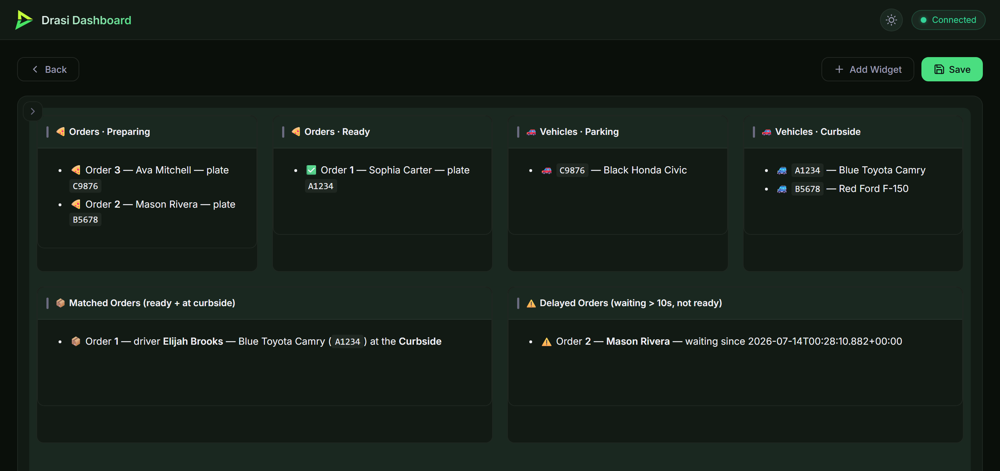
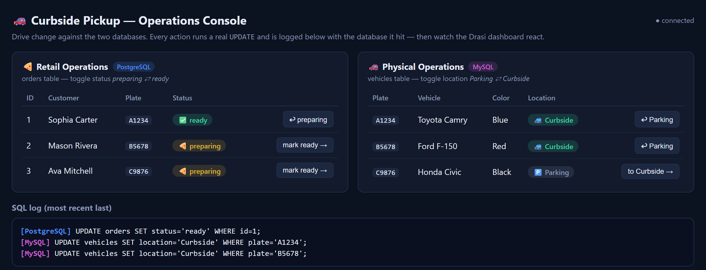

<!-- DO NOT EDIT. Generated from _index.md by scripts/render-tutorials.py. Edit _index.md and run `python3 scripts/render-tutorials.py`. -->

Imagine a store running curbside pickup. The **retail team** manages customer orders in one database and marks an order *ready* when it's prepared. Independently, the **physical operations team** tracks pickup vehicles in *another* database, and a driver sets their location to *Curbside* when they arrive. The two systems never talk to each other.

You want a single live dashboard with six panels:

- an **Orders · Preparing** panel and an **Orders · Ready** panel, so an order visibly moves from one to the other the moment it's marked *ready*,
- a **Vehicles · Parking** panel and a **Vehicles · Curbside** panel, so a car moves between them as the driver pulls up, plus the two situations that matter:
- a **Matched Orders** panel that lights up the instant an order is *ready* **and** its driver is at the curbside, so staff know exactly which order to carry out, and
- a **Delayed Orders** panel that flags drivers who have been waiting at the curbside too long while their order still isn't ready.

The catch: the orders live in **PostgreSQL** and the vehicles live in **MySQL**, and what you care about - a *ready* order whose driver has *arrived* - only exists when you combine a fact from each. Building this the traditional way means **polling both databases**, and that's where it gets awkward. Do you poll the orders, and for each *ready* one go look up its vehicle in the other database? Then a car pulling up to the curbside changes nothing until your *next* orders poll happens to re-check it - you react to order changes but sit blind to vehicle changes between polls. Flip it around and poll the vehicles instead, and now you're blind to an order flipping to *ready*. Either way you get reactivity from **one** side and stale, interval-delayed lookups on the other, and the more sources you add the worse the fan-out of cross-database queries gets. This tutorial builds it on **Drasi Server** instead: two sources, six continuous queries (two of which join across both databases), and the built-in **dashboard reaction** - **no application code to write**. Drasi watches the change feed of *both* databases at once, so a change on **either** side re-evaluates the join immediately - no polling, no blind side. A small browser-based **operations console** stands in for the two operations teams so you can drive the changes yourself and watch every SQL statement as it runs.

**Sources** → **Continuous Queries** → **Reactions**

- **Sources** — Connect to your data sources
- **Continuous Queries** — Define what changes matter
- **Reactions** — Take action automatically

| Step | What You'll Do |
| ---- | ------------- |
| **[Step 1: Set Up Your Environment](#step-1-of-4-set-up-your-environment)** | Open the dev container (or install the tools locally) |
| **[Step 2: Run the Demo](#step-2-of-4-run-the-demo)** | One command starts both databases, Drasi Server, and the operations console |
| **[Step 3: Open the Dashboard](#step-3-of-4-open-the-dashboard)** | Watch all six panels update live |
| **[Step 4: Drive Change](#step-4-of-4-drive-change)** | Use the browser console to change orders and vehicles, and watch Drasi react |
| **[How It Works](#how-it-works)** | Understand the two sources, the cross-database join, and the six queries |

> **Before you begin**
>
> - **One terminal:** a single command starts the databases, Drasi Server, and the operations console together; it stays in the foreground. You drive changes from your **browser**.
> - **Working directory:** run every command from the tutorial directory (`tutorials/curbside-pickup/`). The dev container opens there automatically; if you're running locally, `cd tutorials/curbside-pickup` first.
> - **Command tabs:** commands are shown in tabs (*bash / zsh* and *PowerShell*). Use the one for your shell. The dev container and Codespaces use *bash*.
> - **Ports:** the Drasi Server API is on `8480`, the dashboard is on `3000`, the operations console is on `3001`, PostgreSQL is published on `5742`, and MySQL on `3309`.

## Step 1 of 4: Set Up Your Environment
This tutorial needs **Docker** (it runs PostgreSQL and MySQL) and **Node.js 18+** (for the operations console). The easiest way to get everything is the **dev container**.

### Option A: Dev Container or GitHub Codespaces (recommended)

1. Open this repository in VS Code and run **Reopen in Container** (or create a **Codespace** from the repo's **Code** menu).
2. When prompted for a configuration, choose **Drasi Server - Curbside Pickup Tutorial**.
3. Wait for the container to finish. Its setup script downloads the Drasi Server binary and installs the console's dependencies.

That's it. Skip ahead to [Step 2](#step-2-of-4-run-the-demo).

### Option B: Run Locally

You'll need **Docker**, **Node.js 18+**, and **bash** (the helper scripts use it; on Windows use Git Bash or WSL, or use the PowerShell tabs). From the repository root, move into the tutorial directory and download the Drasi Server binary:

**bash / zsh**

```bash
cd tutorials/curbside-pickup
bash scripts/download.sh
```

**PowerShell**

```powershell
cd tutorials/curbside-pickup
powershell -ExecutionPolicy Bypass -File scripts/download.ps1
```

This places the binary at `bin/drasi-server` (or `bin\drasi-server.exe` on Windows) inside the tutorial directory.

## Step 2 of 4: Run the Demo
Everything runs from a single configuration file, `server-config.yaml`. Start the demo:

**bash / zsh**

```bash
bash scripts/start-demo.sh
```

**PowerShell**

```powershell
powershell -ExecutionPolicy Bypass -File scripts/start-demo.ps1
```

The `start-demo` script does three things:

1. **Starts the databases.** PostgreSQL comes up with logical replication enabled and the `orders` table seeded (three orders, all *preparing*). MySQL comes up with **ROW-based binary logging** (and GTID mode) enabled on the `vehicles` table (three vehicles, all *Parking*) - the plates match the orders.
2. **Runs Drasi Server** in the foreground with the full configuration.
3. **Starts the operations console** (a small Node.js app) in the background on port `3001`, so you have everything you need from this one command.

On first start, Drasi Server downloads the plugins it needs (`source/postgres`, `bootstrap/postgres`, `source/mysql`, `bootstrap/mysql`, `reaction/dashboard`) from `ghcr.io/drasi-project` and caches them under `~/.drasi/plugins`, connects to both databases, bootstraps the existing rows, starts the six continuous queries, and starts the dashboard. When you see a line like the following, it's ready:

```text
Drasi Server started successfully with API on port 8480
```

Leave this running. Everything else happens in your **browser**.

> **Stopping and resetting**
>
> Press **Ctrl+C** in the terminal to stop the server and the operations console together. To remove the database containers when you're completely done, run `bash scripts/cleanup.sh` (bash) or `powershell -ExecutionPolicy Bypass -File scripts/cleanup.ps1` (PowerShell). Add `--volumes` to also delete the database data.

## Step 3 of 4: Open the Dashboard
Drasi Server's dashboard reaction hosts the live dashboard; there's no separate app to build or run. **Wait until the terminal prints `Drasi Server started successfully`** (the first run takes a little longer while the plugins download), then open it in your browser:

```text
http://localhost:3000
```

In the dev container or Codespaces, port `3000` is forwarded automatically. Open the seeded **Curbside Pickup** dashboard. It has six Markdown panels: the four list panels sit side by side on the top row, with the two join panels below:

- 🍕 **Orders · Preparing** and 🍕 **Orders · Ready** - every order in PostgreSQL, split by status. An order appears in exactly one of the two, and jumps from *Preparing* to *Ready* the instant its status changes.
- 🚗 **Vehicles · Parking** and 🚗 **Vehicles · Curbside** - every vehicle in MySQL, split by location. A vehicle moves from *Parking* to *Curbside* the instant its location changes.
- 📦 **Matched Orders** - orders that are *ready* whose driver is at the *Curbside* (the `delivery` query).
- ⚠️ **Delayed Orders** - drivers who have waited at the curbside for more than 10 seconds while their order is still being prepared (the `delay` query).

At bootstrap all three orders are *preparing* and all three vehicles are in *Parking*, so those two panels list every row while their **Ready** and **Curbside** counterparts start empty. The **Matched Orders** and **Delayed Orders** panels also start **empty** - no order is *ready* and no vehicle is at the *Curbside* yet - and fill in as you drive changes. Every panel updates the instant the data changes, with no refreshing; because each panel is backed by a filtered continuous query, a row simply disappears from one panel and reappears in the other as it changes.



## Step 4 of 4: Drive Change
You drive changes from an **operations console** - the small browser app that `start-demo` launched alongside Drasi Server. It connects directly to both databases and, as you make changes, prints **every SQL statement it runs and which database it hit**, so you can see exactly what Drasi is reacting to. Open it in your browser:

```text
http://localhost:3001
```

It has two panels - **Retail Operations** (the PostgreSQL `orders` table) and **Physical Operations** (the MySQL `vehicles` table) - and a live SQL log beneath them. Each row has a button that toggles it: *mark ready →* / *to Curbside →* and back. As you click, the SQL log fills in, colour-coded by database.



Keep the dashboard (`http://localhost:3000`) open in another tab or window so you can watch it react as you drive changes here.

### Trigger a delivery

Mark order **A1234** (Sophia Carter) *ready*. The console logs:

```text
[PostgreSQL] UPDATE orders SET status='ready' WHERE id=1;
```

Watch the dashboard: order **A1234** immediately leaves the 🍕 **Orders · Preparing** panel and appears in 🍕 **Orders · Ready**. Now move vehicle **A1234** to *Curbside*:

```text
[MySQL] UPDATE vehicles SET location='Curbside' WHERE plate='A1234';
```

The vehicle jumps from 🚗 **Vehicles · Parking** to 🚗 **Vehicles · Curbside**, and within about a second the 📦 **Matched Orders** panel reacts: order **A1234** appears with its driver and vehicle. Nothing polled anything - Drasi saw the PostgreSQL change through logical replication and the MySQL change through the binary log, and re-evaluated the cross-database join.

Move the vehicle back to *Parking* and the row disappears from **Matched Orders**: the order is no longer matched to a waiting driver.

### Trigger a delay

Now reproduce the *other* scenario. Pick a vehicle whose order is **not** ready - say **B5678** (Mason Rivera) - and move it to *Curbside*, but **leave order B5678 as *preparing***. Nothing happens immediately. After **10 seconds** the **Delayed Orders** panel lights up: order **B5678** appears, flagging that the driver has been waiting too long.

This is the interesting one. Drasi doesn't poll to find slow orders - the **continuous query schedules its own future re-evaluation** for the moment the 10-second threshold is crossed, and fires exactly then. If you mark the order *ready* (or send the driver back to *Parking*) before the 10 seconds elapse, the alert never appears.

### Reset

Return everything to the starting state (all orders *preparing*, all vehicles *Parking*):

**bash / zsh**

```bash
bash scripts/reset.sh
```

**PowerShell**

```powershell
powershell -ExecutionPolicy Bypass -File scripts/reset.ps1
```

## How It Works
Everything you just ran is described by the single `server-config.yaml`. Here's what each part does.

### Two Sources

The queries join data from two different databases, so the configuration declares two sources.

**PostgreSQL** holds the orders and streams changes via **logical replication (CDC)**:

```yaml
sources:
  - kind: postgres
    id: retail-ops
    # ... connection settings ...
    tables:
      - orders
    tableKeys:
      - table: orders
        keyColumns:
          - id
    bootstrapProvider:
      kind: postgres
```

**MySQL** holds the vehicles and streams changes via its **binary log (binlog)**. The Drasi source reads the binlog directly, so `database/docker-compose.yml` starts MySQL with ROW-based logging, full row images/metadata, and GTID mode, and `database/mysql-init.sql` grants the Drasi user the replication privileges it needs:

```yaml
  - kind: mysql
    id: physical-ops
    # ... connection settings ...
    sslMode: disabled
    tables:
      - vehicles
    tableKeys:
      - table: vehicles
        keyColumns:
          - plate
    bootstrapProvider:
      kind: mysql
      # ... the MySQL bootstrap provider takes its own connection settings ...
```

Each table row becomes a graph node. The `orders` table becomes `orders` nodes and the `vehicles` table becomes `vehicles` nodes, matching the `(o:orders)` and `(v:vehicles)` patterns in the queries.

### The Synthetic Join

There is no foreign key between the two databases - they're completely separate systems. Drasi creates the relationship in the query with a **synthetic join**, matching a vehicle to an order whenever their `plate` values are equal:

```yaml
joins:
  - id: PICKUP_BY
    keys:
      - label: vehicles
        property: plate
      - label: orders
        property: plate
```

The queries then walk that relationship with `(o:orders)-[:PICKUP_BY]->(v:vehicles)` as if it were a real graph edge - across two different databases.

### The Six Continuous Queries

Four of the queries are simple single-source lists, filtered by state, that feed the split **Orders** and **Vehicles** panels. Because each one matches only part of the table, a row leaves one query's result and joins the other's the instant its status or location changes - which is exactly what makes it hop between panels on the dashboard. `orders-preparing` and `orders-ready` split the PostgreSQL orders by status:

```cypher
MATCH
  (o:orders)
WHERE o.status <> 'ready'          // orders-ready uses: o.status = 'ready'
RETURN
  o.id AS orderId,
  o.customer_name AS customerName,
  o.driver_name AS driverName,
  o.plate AS plate,
  o.status AS status
```

and `vehicles-parking` and `vehicles-curbside` split the MySQL vehicles by location:

```cypher
MATCH
  (v:vehicles)
WHERE v.location = 'Parking'        // vehicles-curbside uses: v.location = 'Curbside'
RETURN
  v.plate AS plate,
  v.make AS make,
  v.model AS model,
  v.color AS color,
  v.location AS location
```

The other two join across both databases. **Delivery** returns an order whenever it is *ready* and its driver's vehicle is at the *Curbside*. Because every order starts *preparing* and every vehicle starts *Parking*, a row can only appear once real changes move an order to ready and a vehicle to curbside, so the dashboard starts empty and fills in as changes are driven live:

```cypher
MATCH
  (o:orders)-[:PICKUP_BY]->(v:vehicles)
WHERE o.status = 'ready'
AND v.location = 'Curbside'
RETURN
  o.id AS orderId,
  o.driver_name AS driverName,
  o.plate AS vehicleId,
  v.make AS vehicleMake,
  v.model AS vehicleModel,
  v.color AS vehicleColor,
  v.location AS vehicleLocation,
  drasi.listMax([drasi.changeDateTime(o), drasi.changeDateTime(v)]) AS readyTimestamp
```

**Delay** returns an order whose driver has been at the *Curbside* for more than 10 seconds while the order still isn't *ready*. It uses **`drasi.trueFor`**, which schedules a future re-evaluation and fires the moment the condition has held for the given duration, so the order appears exactly when the 10-second threshold is crossed:

```cypher
MATCH
  (o:orders)-[:PICKUP_BY]->(v:vehicles)
WHERE o.status <> 'ready'
AND drasi.trueFor(v.location = 'Curbside', duration({ seconds: 10 }))
RETURN
  o.id AS orderId,
  o.customer_name AS customerName,
  drasi.changeDateTime(v) AS waitingSinceTimestamp
```

> **How the timing works**
>
> Both the PostgreSQL and MySQL sources stamp every change with the wall-clock time it happened, which `drasi.changeDateTime()` exposes. `drasi.trueFor` uses that timestamp to anchor its 10-second timer - so the delay query fires exactly when a curbside vehicle has waited long enough - and the delay panel reports it as `waitingSinceTimestamp`, with no extra timestamp columns or application bookkeeping required.

### The Dashboard Reaction

A single dashboard reaction subscribes to all six queries and seeds one **Curbside Pickup** dashboard on first start. It lays out six Markdown (`text`) widgets on a 12-column grid; each widget names one query and renders that query's rows with a Handlebars template - no KPIs or tables to configure, just a list. Here's the reaction envelope plus one representative widget (the other five follow the same shape):

```yaml
reactions:
  - kind: dashboard
    id: curbside-dashboard
    queries:
      - orders-preparing
      - orders-ready
      - vehicles-parking
      - vehicles-curbside
      - delivery
      - delay
    port: 3000
    predefinedDashboards:
      - id: curbside-pickup
        name: Curbside Pickup
        gridOptions:
          columns: 12
          rowHeight: 60
          margin: 10
        widgets:
          # The four list panels sit side by side on the top row (w: 3 each);
          # the two join panels (delivery, delay) span the row below (w: 6).
          - id: orders-preparing
            type: text
            title: 🍕 Orders · Preparing
            grid: { x: 0, y: 0, w: 3, h: 4 }
            config:
              queryId: orders-preparing
              # Handlebars: loop the query's `rows` into a Markdown list.
              template: |
                {{#if count}}
                {{#each rows}}
                - 🍕 Order **{{this.orderId}}** — {{this.customerName}} — plate `{{this.plate}}`
                {{/each}}
                {{else}}
                _No orders being prepared._
                {{/if}}
          # - orders-ready, vehicles-parking, vehicles-curbside (top row) ...
          # - delivery, delay (bottom row, w: 6 each) ...
```

Each `text` widget's `template` loops over its query's `rows` and prints a Markdown bullet per result (or the `{{else}}` placeholder when empty); when a query's result set changes, the reaction pushes the update to the browser. That's the whole UI - no front-end code to write or host.

### Driving Change

The operations console (`webui/`) is a small Node.js app - a tiny [Express](https://expressjs.com/) server serving a static page - that connects straight to PostgreSQL and MySQL and runs ordinary `UPDATE` statements, the same kind your real retail and physical-operations apps would run. `start-demo` launches it alongside Drasi Server and stops it again on Ctrl+C. It's a convenience for the tutorial, not part of Drasi: Drasi reacts to the database changes however they're made.

## Putting It All Together

The sections above walked through the configuration one piece at a time. Here
is the complete `server-config.yaml` that `start-demo` actually runs - both
sources, all six continuous queries, and the full dashboard reaction in a
single file:

```yaml
# =============================================================================
# Drasi Server - Curbside Pickup Tutorial
# =============================================================================
# Powers a single real-time dashboard over two independent databases:
#   - retail-ops   : a PostgreSQL "orders" table (Retail Operations)
#   - physical-ops : a MySQL "vehicles" table (Physical Operations)
#
# Six continuous queries feed the dashboard. Four are simple filtered lists
# (orders-preparing, orders-ready, vehicles-parking, vehicles-curbside) that
# split the orders and vehicles by state so a row moves between panels as it
# changes; two join the orders to the vehicles by license plate:
#   - delivery : an order is 'ready' AND its driver's vehicle is at 'Curbside'
#   - delay    : a driver has waited at 'Curbside' for over 10s while the order
#                is still being prepared (uses the temporal drasi.trueFor)
#
# The dashboard reaction renders all six, live, in one "Curbside Pickup"
# dashboard at http://localhost:3000 - no application code to write.
# =============================================================================

apiVersion: drasi.io/v1
id: curbside-pickup-server
host: "${SERVER_HOST:-0.0.0.0}"
port: ${SERVER_PORT:-8480}
logLevel: "${LOG_LEVEL:-info}"
persistConfig: false

# Plugins are downloaded from the OCI registry (ghcr.io/drasi-project) on first
# startup. No manual build step is required.
autoInstallPlugins: true
plugins:
  - ref: source/postgres
  - ref: bootstrap/postgres
  - ref: source/mysql
  - ref: bootstrap/mysql
  - ref: reaction/dashboard

# =============================================================================
# Sources
# =============================================================================
sources:
  # Retail Operations - PostgreSQL source: the customer orders.
  - kind: postgres
    id: retail-ops
    autoStart: true

    host: "${POSTGRES_HOST:-localhost}"
    port: ${POSTGRES_PORT:-5742}
    database: "${POSTGRES_DATABASE:-RetailOperations}"
    user: "${POSTGRES_USER:-drasi_user}"
    password: "${POSTGRES_PASSWORD:-drasi_password}"
    sslMode: prefer

    # Table to monitor. Lower-case/unquoted so the node label matches (o:orders).
    tables:
      - orders

    # The publication is created by database/postgres-init.sql; the slot is
    # created automatically by the source on startup (with a consistent
    # snapshot), so the seeded rows are bootstrapped once and not double-counted.
    slotName: drasi_curbside_slot
    publicationName: drasi_curbside_pub

    # Primary key, so Drasi can track row identity across changes.
    tableKeys:
      - table: orders
        keyColumns:
          - id

    # Bootstrap provider loads the existing orders on startup.
    bootstrapProvider:
      kind: postgres

  # Physical Operations - MySQL source: the pickup vehicles.
  # The MySQL source captures changes by streaming the binary log (binlog), so
  # database/docker-compose.yml starts MySQL with ROW-based logging, full row
  # images/metadata and GTID mode.
  - kind: mysql
    id: physical-ops
    autoStart: true

    host: "${MYSQL_HOST:-localhost}"
    port: ${MYSQL_PORT:-3309}
    database: "${MYSQL_DATABASE:-PhysicalOperations}"
    user: "${MYSQL_USER:-drasi_user}"
    password: "${MYSQL_PASSWORD:-drasi_password}"
    # The tutorial MySQL container does not enable TLS; disable it so the source
    # connects in plaintext (the client otherwise negotiates TLS and fails).
    sslMode: disabled

    # Table to monitor. The node label is the table name `vehicles`, matching
    # (v:vehicles) in the queries.
    tables:
      - vehicles

    # Primary key, so Drasi can track row identity across changes.
    tableKeys:
      - table: vehicles
        keyColumns:
          - plate

    # Bootstrap provider loads the existing vehicles on startup. Unlike the
    # PostgreSQL bootstrap provider (which reuses the source connection), the
    # MySQL bootstrap provider takes its own connection settings. Note it does
    # not accept an sslMode field.
    bootstrapProvider:
      kind: mysql
      host: "${MYSQL_HOST:-localhost}"
      port: ${MYSQL_PORT:-3309}
      database: "${MYSQL_DATABASE:-PhysicalOperations}"
      user: "${MYSQL_USER:-drasi_user}"
      password: "${MYSQL_PASSWORD:-drasi_password}"
      tables:
        - vehicles
      tableKeys:
        - table: vehicles
          keyColumns:
            - plate

# =============================================================================
# Continuous Queries
# =============================================================================
# Six queries feed the dashboard:
#   - orders-preparing  : orders not yet ready (the "Preparing" panel)
#   - orders-ready      : orders ready for pickup (the "Ready" panel)
#   - vehicles-parking  : vehicles in the lot (the "Parking" panel)
#   - vehicles-curbside : vehicles at the curb (the "Curbside" panel)
#   - delivery          : matched orders - ready AND at the curbside
#   - delay             : delayed orders - at the curbside too long while not ready
# delivery and delay declare the synthetic PICKUP_BY join, matching a vehicle to
# an order by license plate (vehicles.plate == orders.plate).
queries:
  # orders-preparing: orders still being prepared (status != 'ready'). As soon as
  # an order becomes 'ready' it drops out of this result and appears in
  # orders-ready - so the order visibly moves between the two dashboard panels.
  - id: orders-preparing
    autoStart: true
    queryLanguage: Cypher
    sources:
      - sourceId: retail-ops
        nodes:
          - orders
    query: |
      MATCH
        (o:orders)
      WHERE o.status <> 'ready'
      RETURN
        o.id AS id,
        o.id AS orderId,
        o.customer_name AS customerName,
        o.driver_name AS driverName,
        o.plate AS plate,
        o.status AS status

  # orders-ready: orders that are ready for pickup (status = 'ready').
  - id: orders-ready
    autoStart: true
    queryLanguage: Cypher
    sources:
      - sourceId: retail-ops
        nodes:
          - orders
    query: |
      MATCH
        (o:orders)
      WHERE o.status = 'ready'
      RETURN
        o.id AS id,
        o.id AS orderId,
        o.customer_name AS customerName,
        o.driver_name AS driverName,
        o.plate AS plate,
        o.status AS status

  # vehicles-parking: vehicles still in the parking lot (location = 'Parking').
  # When a driver pulls up to the curb the vehicle drops out of this result and
  # appears in vehicles-curbside - so the car visibly moves between the panels.
  - id: vehicles-parking
    autoStart: true
    queryLanguage: Cypher
    sources:
      - sourceId: physical-ops
        nodes:
          - vehicles
    query: |
      MATCH
        (v:vehicles)
      WHERE v.location = 'Parking'
      RETURN
        v.plate AS id,
        v.plate AS plate,
        v.make AS make,
        v.model AS model,
        v.color AS color,
        v.location AS location

  # vehicles-curbside: vehicles waiting at the curb (location = 'Curbside').
  - id: vehicles-curbside
    autoStart: true
    queryLanguage: Cypher
    sources:
      - sourceId: physical-ops
        nodes:
          - vehicles
    query: |
      MATCH
        (v:vehicles)
      WHERE v.location = 'Curbside'
      RETURN
        v.plate AS id,
        v.plate AS plate,
        v.make AS make,
        v.model AS model,
        v.color AS color,
        v.location AS location

  # delivery: orders that are READY whose driver has ARRIVED at the curbside.
  - id: delivery
    autoStart: true
    queryLanguage: Cypher
    sources:
      - sourceId: physical-ops
        nodes:
          - vehicles
      - sourceId: retail-ops
        nodes:
          - orders
    joins:
      - id: PICKUP_BY
        keys:
          - label: vehicles
            property: plate
          - label: orders
            property: plate
    query: |
      MATCH
        (o:orders)-[:PICKUP_BY]->(v:vehicles)
      WHERE o.status = 'ready'
      AND v.location = 'Curbside'
      RETURN
        o.id AS id,
        o.id AS orderId,
        o.status AS orderStatus,
        o.driver_name AS driverName,
        o.plate as vehicleId,
        v.make as vehicleMake,
        v.model as vehicleModel,
        v.color as vehicleColor,
        v.location as vehicleLocation,
        drasi.listMax([drasi.changeDateTime(o), drasi.changeDateTime(v)]) as readyTimestamp

  # delay: a driver is at the curbside but the order is NOT yet ready, and they
  # have been waiting for more than 10 seconds. drasi.trueFor schedules a future
  # re-evaluation so the row appears the instant the threshold is crossed.
  - id: delay
    autoStart: true
    queryLanguage: Cypher
    sources:
      - sourceId: physical-ops
        nodes:
          - vehicles
      - sourceId: retail-ops
        nodes:
          - orders
    joins:
      - id: PICKUP_BY
        keys:
          - label: vehicles
            property: plate
          - label: orders
            property: plate
    # drasi.trueFor anchors its timer to the change's effective_from, which both
    # the PostgreSQL and MySQL sources populate with the wall-clock time of the
    # change. The row appears the instant the vehicle has been at 'Curbside' for
    # 10 seconds while the order is still not ready.
    query: |
      MATCH
        (o:orders)-[:PICKUP_BY]->(v:vehicles)
      WHERE o.status <> 'ready'
      AND drasi.trueFor(v.location = 'Curbside', duration({ seconds: 10 }))
      RETURN
        o.id AS orderId,
        o.customer_name AS customerName,
        drasi.changeDateTime(v) AS waitingSinceTimestamp

# =============================================================================
# Reactions
# =============================================================================
reactions:
  # Dashboard reaction - serves a live web dashboard at http://localhost:3000.
  # A single "Curbside Pickup" dashboard is seeded with six Markdown (text)
  # widgets arranged in two rows:
  #   🍕 Orders Preparing | 🍕 Orders Ready | 🚗 Vehicles Parking | 🚗 Vehicles Curbside
  #   📦 Matched Orders                     | ⚠️  Delayed Orders
  # Because the "preparing/ready" and "parking/curbside" panels are driven by
  # filtered continuous queries, an order or vehicle disappears from one panel
  # and appears in the other the instant its status/location changes.
  - kind: dashboard
    id: curbside-dashboard
    autoStart: true
    queries:
      - orders-preparing
      - orders-ready
      - vehicles-parking
      - vehicles-curbside
      - delivery
      - delay
    host: "${DASHBOARD_HOST:-0.0.0.0}"
    port: ${DASHBOARD_PORT:-3000}
    heartbeatIntervalMs: 15000
    predefinedDashboards:
      - id: curbside-pickup
        name: Curbside Pickup
        gridOptions:
          columns: 12
          rowHeight: 60
          margin: 10
        widgets:
          # Orders being prepared (Retail Operations / PostgreSQL).
          - id: orders-preparing
            type: text
            title: 🍕 Orders · Preparing
            grid: { x: 0, y: 0, w: 3, h: 4 }
            config:
              queryId: orders-preparing
              template: |
                {{#if count}}
                {{#each rows}}
                - 🍕 Order **{{this.orderId}}** — {{this.customerName}} — plate `{{this.plate}}`
                {{/each}}
                {{else}}
                _No orders being prepared._
                {{/if}}

          # Orders ready for pickup (Retail Operations / PostgreSQL).
          - id: orders-ready
            type: text
            title: 🍕 Orders · Ready
            grid: { x: 3, y: 0, w: 3, h: 4 }
            config:
              queryId: orders-ready
              template: |
                {{#if count}}
                {{#each rows}}
                - ✅ Order **{{this.orderId}}** — {{this.customerName}} — plate `{{this.plate}}`
                {{/each}}
                {{else}}
                _No orders ready for pickup._
                {{/if}}

          # Vehicles in the parking lot (Physical Operations / MySQL).
          - id: vehicles-parking
            type: text
            title: 🚗 Vehicles · Parking
            grid: { x: 6, y: 0, w: 3, h: 4 }
            config:
              queryId: vehicles-parking
              template: |
                {{#if count}}
                {{#each rows}}
                - 🚗 `{{this.plate}}` — {{this.color}} {{this.make}} {{this.model}}
                {{/each}}
                {{else}}
                _No vehicles in the parking lot._
                {{/if}}

          # Vehicles waiting at the curb (Physical Operations / MySQL).
          - id: vehicles-curbside
            type: text
            title: 🚗 Vehicles · Curbside
            grid: { x: 9, y: 0, w: 3, h: 4 }
            config:
              queryId: vehicles-curbside
              template: |
                {{#if count}}
                {{#each rows}}
                - 🚙 `{{this.plate}}` — {{this.color}} {{this.make}} {{this.model}}
                {{/each}}
                {{else}}
                _No vehicles at the curb._
                {{/if}}

          # Matched orders (delivery query): ready AND at the curbside.
          - id: matched-orders
            type: text
            title: 📦 Matched Orders (ready + at curbside)
            grid: { x: 0, y: 4, w: 6, h: 4 }
            config:
              queryId: delivery
              template: |
                {{#if count}}
                {{#each rows}}
                - 📦 Order **{{this.orderId}}** — driver **{{this.driverName}}** — {{this.vehicleColor}} {{this.vehicleMake}} {{this.vehicleModel}} (`{{this.vehicleId}}`) at the **Curbside**
                {{/each}}
                {{else}}
                ⏳ _No orders ready with a driver at the curbside._
                {{/if}}

          # Delayed orders (delay query): waiting at the curbside for over 10s.
          - id: delayed-orders
            type: text
            title: ⚠️ Delayed Orders (waiting > 10s, not ready)
            grid: { x: 6, y: 4, w: 6, h: 4 }
            config:
              queryId: delay
              template: |
                {{#if count}}
                {{#each rows}}
                - ⚠️ Order **{{this.orderId}}** — **{{this.customerName}}** — waiting since {{this.waitingSinceTimestamp}}
                {{/each}}
                {{else}}
                ✅ _No delayed orders._
                {{/if}}
```

## Clean Up

When you're done, stop Drasi Server and the operations console with **Ctrl+C** in the terminal, then remove the database containers:

**bash / zsh**

```bash
bash scripts/cleanup.sh --volumes
```

**PowerShell**

```powershell
powershell -ExecutionPolicy Bypass -File scripts/cleanup.ps1 --volumes
```
