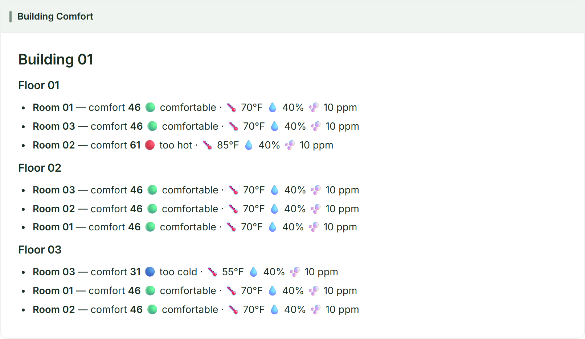

<!-- DO NOT EDIT. Generated from _index.md by scripts/render-tutorials.py. Edit _index.md and run `python3 scripts/render-tutorials.py`. -->

Many teams already run **Debezium** for change data capture. This tutorial shows how to feed those change events into **Drasi Server** without rewriting your application or replacing your database — you only change the path between the database and Drasi.

You'll reuse the same **Building Comfort** scenario as the [Building Comfort tutorial](../building-comfort/): a PostgreSQL building with floors and rooms, six continuous queries, and the live dashboard reaction. The queries and dashboard stay the same. What changes is **how change events get from PostgreSQL into Drasi**.

**Two integration paths:**

| Path | Pipeline | Drasi source | When to use it |
| ---- | -------- | ------------ | -------------- |
| **1. Debezium Server → HTTP** | Postgres → Debezium Server → HTTP POST | `source/http` | No Kafka in your stack; simplest glue |
| **2. Kafka Connect → Kafka** | Postgres → Debezium Connect → Kafka topic | `source/kafka` | You already run Kafka / Connect |

**PostgreSQL** → **Debezium** → **Drasi Server** → **Dashboard**

- **PostgreSQL**: Building · Floor · Room
- **Debezium**: Server or Connect
- **Drasi Server**: HTTP or Kafka source
- **Dashboard**: Live comfort view

| Step | What You'll Do | Time |
| ---- | ------------- | ---- |
| **[Step 1: Set Up Your Environment](#step-1-of-4-set-up-your-environment)** | Open the dev container (or install tools locally) | 5 min |
| **[Step 2: Path 1 — Debezium Server → HTTP](#step-2-of-4-path-1-debezium-server-http)** | Run the HTTP integration end to end | 10 min |
| **[Step 3: Path 2 — Kafka Connect → Kafka](#step-3-of-4-path-2-kafka-connect-kafka)** | Run the Kafka integration end to end | 10 min |
| **[Step 4: Drive Change](#step-4-of-4-drive-change)** | Update Postgres rows and watch events flow through Debezium into Drasi | 5 min |
| **[How It Works](#how-it-works)** | Minimal Debezium setup (no magic), mappings, and config walkthrough | 10 min |

> **Before you begin**
>
> - **Terminals:** **Terminal 1** runs the demo (stays in the foreground). **Terminal 2** drives SQL changes and optional debug commands.
> - **Working directory:** run every command from `tutorials/debezium-integration/`. The dev container opens there automatically.
> - **Command tabs:** bash is shown first (Codespaces / dev container). Use the PowerShell notes only when running locally on Windows.
> - **Ports:** API `8380`, dashboard `3000`, Postgres `5752`, HTTP CDC `9080`, Kafka `19092`, Connect REST `8083`.
> - **One path at a time:** finish Path 1 (or clean up) before starting Path 2 so containers and replication slots don't collide.

## Step 1 of 4: Set Up Your Environment
### Option A: Dev Container or GitHub Codespaces (recommended)

1. Open the [`learning-drasi-server`](https://github.com/drasi-project/learning-drasi-server) repository in VS Code and run **Reopen in Container** (or create a **Codespace** from the repo's **Code** menu).
2. When prompted for a configuration, choose **Drasi Server - Debezium Integration Tutorial**.
3. Wait for the container to finish. Its setup script downloads the Drasi Server binary and installs the PostgreSQL client.

That's it — skip ahead to [Step 2](#step-2-of-4-path-1-debezium-server-http).

### Option B: Run Locally

You'll need **Docker**, **curl**, and **bash** (Git Bash or WSL on Windows). From the repository root:

**bash / zsh**

```bash
cd tutorials/debezium-integration
bash scripts/download.sh
```

**PowerShell**

```powershell
cd tutorials/debezium-integration
powershell -ExecutionPolicy Bypass -File scripts/download.ps1
```

### Option C: Build from Source

Follow the [**Build from Source**](https://drasi.io/drasi-server/how-to-guides/installation/build-from-source/) guide, then copy the binary into this tutorial's `bin/` directory (same layout as Option B).

## Step 2 of 4: Path 1 — Debezium Server → HTTP
**Goal:** Debezium Server reads PostgreSQL's WAL, then **POSTs** each change event to Drasi's HTTP source. No Kafka required.

```text
PostgreSQL  ──WAL──►  Debezium Server  ──HTTP POST──►  Drasi HTTP source  ──►  queries / dashboard
```

In **Terminal 1**:

**bash / zsh**

```bash
bash scripts/start-demo-http.sh
```

**PowerShell**

```powershell
# Prefer Git Bash / WSL for the demo scripts.
bash scripts/start-demo-http.sh
```

What this does (see [Minimal Debezium setup](#minimal-debezium-setup-no-magic) for the non-magic version):

1. Starts **PostgreSQL** (logical replication enabled) and seeds 1 building / 3 floors / 9 rooms (`init.sql`).
2. Starts **Drasi Server** with `server-config-http.yaml` and waits until the HTTP webhook is healthy on port `9080`.
3. Starts **Debezium Server** (Compose profile `http`) with a **fresh offset volume**, using `database/debezium-server/application.properties` — Postgres connector in, HTTP sink out to `http://host.docker.internal:9080/debezium`.

Order is intentional: Debezium commits snapshot offsets after it finishes reading tables. If it started before Drasi was listening, the snapshot could complete without Drasi ever receiving the rows. `start-demo-http.sh` avoids that by bringing Drasi up first, then Debezium with `--reset-offsets`.

On first start, Drasi downloads plugins (`source/http`, `reaction/dashboard`, `reaction/log`). Debezium takes an **initial snapshot** of existing rows (operation `r`) and then streams live changes. When the log shows Drasi started and Debezium is streaming, open the dashboard:

```text
http://localhost:3000
```

You should see every room at comfort **46** (comfortable), the same layout as the Building Comfort tutorial.

Manual two-terminal equivalent:

```bash
bash scripts/setup-database.sh          # Postgres only
bash scripts/start-server.sh http       # Terminal 1 — leave running
# Terminal 2, after Drasi is up:
bash scripts/start-debezium-server.sh --reset-offsets
```

> **Why host.docker.internal?**
>
> Debezium Server runs **inside Docker**. Drasi Server runs on the **host** (or dev container). The sink URL uses `host.docker.internal` (wired via Docker's `host-gateway`) so the container can reach Drasi's HTTP port `9080`. Override with `DEBEZIUM_SINK_HTTP_URL` in `.env` if your network differs.

> **Stopping Path 1 before Path 2**
>
> Press **Ctrl+C** in Terminal 1, then run `bash scripts/cleanup.sh --volumes` so the Debezium Server replication slot and volumes are removed before you start the Kafka path.

## Step 3 of 4: Path 2 — Kafka Connect → Kafka
**Goal:** Debezium runs as a **Kafka Connect** source connector. Change events land on a Kafka topic; Drasi **pulls** them with `source/kafka`.

```text
PostgreSQL  ──WAL──►  Debezium Connect  ──►  Kafka topic building.changes  ──►  Drasi Kafka source
```

Clean up Path 1 if you just ran it, then in **Terminal 1**:

**bash / zsh**

```bash
bash scripts/cleanup.sh --volumes
bash scripts/start-demo-kafka.sh
```

**PowerShell**

```powershell
bash scripts/cleanup.sh --volumes
bash scripts/start-demo-kafka.sh
```

What this does (see [Minimal Debezium setup](#minimal-debezium-setup-no-magic) for the non-magic version):

1. Starts **PostgreSQL**, **Redpanda** (Kafka API on host port `19092`), and **Debezium Connect** (Compose profile `kafka`).
2. Registers the connector with a single REST call using `database/connect/register-postgres.json`.
3. A **RegexRouter** SMT folds per-table topics into a single `building.changes` topic.
4. Runs **Drasi Server** with `server-config-kafka.yaml` (`source/kafka` + dashboard).

Unlike Path 1, Debezium may snapshot **before** Drasi starts. That is fine here: events are durable on the Kafka topic, and Drasi uses `autoOffsetReset: earliest` so it reads the snapshot when it joins the consumer group.

The Kafka source defaults to `bootstrapServers: 127.0.0.1:19092` (not bare `localhost`) so clients that prefer IPv6 for `localhost` still reach Redpanda's IPv4 listener. Override with `KAFKA_BOOTSTRAP_SERVERS` if needed.

This tutorial pins **drasi-server 0.2.3** and **`source/kafka:0.1.7`** (plus matching dashboard/log plugins). That combination is verified on macOS as well as Linux. If you mix a different server build with unpinned plugins, install can fail with an SDK ABI mismatch, or older pairings can abort inside the Kafka consumer.

Wait for:

```text
Drasi Server started successfully with API on port 8380
```

Open `http://localhost:3000` again — same dashboard, different transport.

Optional checks from **Terminal 2**:

**bash / zsh**

```bash
# Connector status
curl -s http://localhost:8083/connectors/building-comfort-connector/status | jq .

# Drasi source status
curl -s http://localhost:8380/api/v1/sources/building-facilities | jq .
```

**PowerShell**

```powershell
curl -s http://localhost:8083/connectors/building-comfort-connector/status
curl -s http://localhost:8380/api/v1/sources/building-facilities
```

## Step 4 of 4: Drive Change
This step is how you **see Debezium working**. The helper scripts do **not** call Drasi or Debezium. They run ordinary SQL `UPDATE`s against PostgreSQL — the same kind of write your building app would already do.

What happens next:

1. PostgreSQL appends the change to its **WAL** (write-ahead log).
2. **Debezium** (Server or Connect) reads that WAL entry and emits a change event.
3. The event reaches Drasi over **HTTP** (Path 1) or **Kafka** (Path 2).
4. Drasi re-evaluates the comfort queries and the **dashboard** updates.

So yes: the tutorial deliberately changes the database so you can watch those changes flow through Debezium into Drasi.

> **No middle tier — scripts only write SQL**
>
> There is no API call to Drasi in this step and no hand-crafted event publish. If the dashboard moves after `break-room.sh`, the path Postgres → Debezium → Drasi is working.

### Break a room

**bash / zsh**

```bash
bash scripts/break-room.sh room_01_01_01
```

**PowerShell**

```powershell
docker exec debezium-integration-postgres psql -U drasi_user -d building_comfort -c "UPDATE \"Room\" SET temperature=40, humidity=20, co2=700 WHERE id='room_01_01_01';"
```

That runs roughly:

```sql
UPDATE "Room"
SET temperature = 40, humidity = 20, co2 = 700
WHERE id = 'room_01_01_01';
```

Within a second or two, **Room 01** on **Floor 01** leaves the comfortable band, alerts appear, and the building gauge drops — evidence the update traveled through Debezium.

### Reset

**bash / zsh**

```bash
bash scripts/reset-room.sh room_01_01_01
# or reset every room:
bash scripts/reset-room.sh
```

**PowerShell**

```powershell
docker exec debezium-integration-postgres psql -U drasi_user -d building_comfort -c "UPDATE \"Room\" SET temperature=70, humidity=40, co2=10 WHERE id='room_01_01_01';"
```

### Custom values and simulation

**bash / zsh**

```bash
bash scripts/set-room.sh room_01_02_03 82 40 10
bash scripts/simulate.sh
```

**PowerShell**

```powershell
docker exec debezium-integration-postgres psql -U drasi_user -d building_comfort -c "UPDATE \"Room\" SET temperature=82, humidity=40, co2=10 WHERE id='room_01_02_03';"
bash scripts/simulate.sh
```

## How It Works
### Minimal Debezium setup (no magic)
The demo scripts look like one command, but they only orchestrate a **small, explicit stack**. Nothing is hidden inside Drasi.

#### Shared pieces (both paths)

| Piece | Where it lives | What it does |
| ----- | -------------- | ------------ |
| PostgreSQL 16 | `database/docker-compose.yml` service `postgres` | Source DB with `wal_level=logical` so CDC can read the WAL |
| Schema + seed | `database/init.sql` | Creates `"Building"` / `"Floor"` / `"Room"`, grants a replication user, seeds 9 comfortable rooms |
| Drasi Server | `bin/drasi-server` + `server-config-*.yaml` | HTTP or Kafka source, comfort queries, dashboard |
| Drive scripts | `scripts/break-room.sh`, `reset-room.sh`, … | Plain SQL updates so you can watch live CDC |

Postgres is started with logical replication settings (not Debezium-specific magic):

```yaml
command:
  - postgres
  - -c
  - wal_level=logical
  - -c
  - max_replication_slots=10
  - -c
  - max_wal_senders=10
```

`init.sql` makes tables replication-ready (`REPLICA IDENTITY FULL`) and creates `drasi_user` with `REPLICATION`. Debezium then creates its **own** publication and replication slot when it starts — Drasi does not own the slot in this tutorial.

#### Path 1 — what “Debezium Server” is here

A **single JVM container** (`quay.io/debezium/server:2.7`) that:

1. Runs the PostgreSQL connector against `postgres:5432`
2. Snapshots existing rows, then tails the WAL
3. POSTs each change as JSON to Drasi’s HTTP source

Compose profile `http` starts that container and mounts one config file:

```text
database/debezium-server/application.properties
```

That file is the whole Server setup in miniature:

- **Source:** `PostgresConnector`, database host/user/password, `table.include.list`, `snapshot.mode=initial`, slot/publication names
- **Sink:** `debezium.sink.type=http` and `debezium.sink.http.url=…/debezium`
- **Format:** plain JSON envelopes (no Kafka Connect schema wrapper)

The sink URL uses `host.docker.internal` because Server runs in Docker while Drasi listens on the host/dev container at port `9080`. Docker’s `host-gateway` mapping makes that hostname resolve; override with `DEBEZIUM_SINK_HTTP_URL` if needed.

`start-demo-http.sh` does:

1. `setup-database.sh` — Postgres only + `init.sql`
2. Starts Drasi with `server-config-http.yaml` and waits for `http://localhost:9080/health`
3. `start-debezium-server.sh --reset-offsets` — Compose profile `http`, wiped offset volume, then snapshot + stream into Drasi

Do **not** start Debezium Server first and assume retries will re-send a finished snapshot. Use the demo script (or the two-terminal sequence above) so the first snapshot lands in Drasi.
#### Path 2 — what “Kafka Connect” is here

Three containers, still minimal:

| Service | Image | Role |
| ------- | ----- | ---- |
| `kafka` | Redpanda (Kafka API) | Topic log Drasi consumes |
| `connect` | `quay.io/debezium/connect:2.7` | Connect runtime hosting the Debezium PostgreSQL connector |
| `postgres` | same as Path 1 | WAL source |

There is no separate ZooKeeper cluster and no hand-installed Connect distribution — the Debezium Connect image **is** the worker. Redpanda speaks the Kafka protocol so Drasi’s `source/kafka` works unchanged.

After Connect’s REST API is up, `setup-database.sh kafka` registers the connector with one POST:

```text
database/connect/register-postgres.json
→ POST http://localhost:8083/connectors
```

That JSON is the Connect equivalent of Server’s properties: connector class, DB connection, tables, snapshot mode, JSON converters, plus a **RegexRouter** SMT so every table’s events land on one topic (`building.changes`) for a single Drasi Kafka source.

`start-demo-kafka.sh` simply:

1. `docker compose --profile kafka up` (Postgres + Redpanda + Connect)
2. Applies `init.sql`
3. Registers the connector
4. Starts Drasi with `server-config-kafka.yaml` (`autoOffsetReset: earliest` so snapshot events already on the topic are read)

#### Mental model

```text
You write SQL ──► PostgreSQL WAL
                      │
          ┌───────────┴───────────┐
          ▼                       ▼
   Debezium Server          Debezium on Connect
   (HTTP sink)              (writes Kafka topic)
          │                       │
          ▼                       ▼
   Drasi HTTP source        Drasi Kafka source
          └───────────┬───────────┘
                      ▼
              Continuous queries → dashboard
```

Files under `database/` are the “install Debezium” story for this tutorial. The scripts only start those containers and register the connector; they do not embed CDC inside Drasi.

### What stayed the same

Compared with the [Building Comfort tutorial](../building-comfort/):

- Same schema: `"Building"`, `"Floor"`, `"Room"`
- Same six continuous queries and synthetic joins (`PART_OF_FLOOR`, `PART_OF_BUILDING`)
- Same dashboard reaction and comfort formula
- Same “write SQL → see the dashboard move” workflow — but the CDC reader is Debezium instead of Drasi’s native Postgres source

### What changed: the source edge

| Building Comfort (native) | This tutorial |
| ------------------------- | ------------- |
| `kind: postgres` source reads the WAL | Debezium reads the WAL |
| `bootstrap/postgres` loads existing rows | Debezium **snapshot** (`op: r`) loads existing rows |
| Drasi owns the replication slot | Debezium owns the slot / publication |

Drasi only needs a source that can turn **Debezium JSON envelopes** into graph `SourceChange` events.

### Debezium envelope → graph mapping

Both configs use the shared **source mapping** engine (HTTP webhook mappings and Kafka `mappings:`).

A Debezium row event looks like:

```json
{
  "op": "u",
  "before": { "id": "room_01_01_01", "temperature": 70, "...": "..." },
  "after":  { "id": "room_01_01_01", "temperature": 40, "...": "..." },
  "source": { "table": "Room", "schema": "public", "db": "building_comfort" }
}
```

The mapping (simplified from the server configs):

```yaml
mappings:
  - when:
      field: source.table
      regex: "^(Building|Floor|Room)$"
    operationFrom: payload.op
    operationMap:
      c: insert   # create
      r: insert   # snapshot read
      u: update
      d: delete
    elementType: node
    template:
      id: "{{#if payload.after.id}}{{payload.after.id}}{{else}}{{payload.before.id}}{{/if}}"
      labels:
        - "{{payload.source.table}}"
      properties: "{{payload.after}}"
```

- **`operationFrom` / `operationMap`** turn Debezium `op` codes into Drasi insert/update/delete.
- **`source.table`** becomes the node label (`Room`, `Floor`, `Building`) so existing Cypher keeps working.
- **`properties: "{{payload.after}}"`** copies the row image; deletes use `before` only for the element id.
- Snapshot rows (`r`) are inserts — that's how initial state appears without a separate bootstrap provider.

### Path 1 config: HTTP source

`server-config-http.yaml` listens for POSTs and maps the body:

```yaml
sources:
  - kind: http
    id: building-facilities
    host: "0.0.0.0"
    port: 9080
    webhooks:
      routes:
        - path: /debezium
          methods: [POST]
          mappings:
            # ... Debezium envelope mapping ...
```

Debezium Server (`database/debezium-server/application.properties`):

```properties
debezium.sink.type=http
debezium.sink.http.url=http://host.docker.internal:9080/debezium
debezium.source.connector.class=io.debezium.connector.postgresql.PostgresConnector
debezium.source.table.include.list=public.Building,public.Floor,public.Room
debezium.source.snapshot.mode=initial
debezium.format.value=json
```

### Path 2 config: Kafka source

Connect registers a connector that writes JSON (no schema wrapper) and routes all tables to one topic:

```json
"transforms": "route",
"transforms.route.type": "org.apache.kafka.connect.transforms.RegexRouter",
"transforms.route.regex": "building\\.public\\.(.*)",
"transforms.route.replacement": "building.changes"
```

Drasi consumes that topic. Plugin refs are pinned next to the server binary pin:

```yaml
plugins:
  - ref: source/kafka:0.1.7
  - ref: reaction/dashboard:0.1.5
  - ref: reaction/log:0.2.7

sources:
  - kind: kafka
    id: building-facilities
    bootstrapServers: "127.0.0.1:19092"
    topic: building.changes
    groupId: drasi-building-comfort
    nodeLabel: Room
    autoOffsetReset: earliest
    mappings:
      # ... same Debezium envelope mapping ...
```

`autoOffsetReset: earliest` matters after a fresh connector snapshot: Drasi reads the snapshot events already on the topic when it starts.

> **Plugin ABI pins**
>
> `drasi-server` **0.2.3** expects plugins built for host SDK ABI **0.13** (the loader rejects 0.14). The pins above are the newest kafka/dashboard/log/http builds that match 0.2.3. Path 1 uses `source/http:0.2.11` with the same dashboard/log pins. If you already have older plugins under `~/.drasi/plugins`, delete that directory (or set `DRASI_PLUGINS_DIR` to a fresh folder) before the first start so auto-install can pull the pinned versions.

### Minimal environment layout

| Component | Image / binary | Role |
| --------- | -------------- | ---- |
| PostgreSQL 16 | `postgres:16-alpine` | Source of truth + WAL |
| Debezium Server 2.7 | `quay.io/debezium/server:2.7` | Path 1 runtime |
| Redpanda | `redpandadata/redpanda` | Path 2 Kafka API |
| Debezium Connect 2.7 | `quay.io/debezium/connect:2.7` | Path 2 connector host |
| Drasi Server | downloaded binary | Continuous queries + dashboard |

Compose profiles keep the stacks small:

```bash
docker compose --profile http up -d    # Path 1 extras
docker compose --profile kafka up -d   # Path 2 extras
```

### Dashboard

Unchanged from Building Comfort — Markdown widgets over the same query ids:



### Debug without the database

Path 1 only — POST a synthetic Debezium event (also in `requests.http`):

```bash
curl -s -X POST http://localhost:9080/debezium \
  -H 'Content-Type: application/json' \
  -d '{"op":"u","after":{"id":"room_01_01_01","name":"Room 01","temperature":40,"humidity":20,"co2":700,"floor_id":"floor_01_01"},"before":{"id":"room_01_01_01","name":"Room 01","temperature":70,"humidity":40,"co2":10,"floor_id":"floor_01_01"},"source":{"table":"Room"}}'
```

## Clean Up
**bash / zsh**

```bash
# Ctrl+C in Terminal 1 first, then:
bash scripts/cleanup.sh

# Remove containers and data volumes (recommended between Path 1 and Path 2):
bash scripts/cleanup.sh --volumes
```

**PowerShell**

```powershell
bash scripts/cleanup.sh --volumes
```

## Next Steps

- Compare with the native path in [Building Comfort](../building-comfort/) (`kind: postgres`).
- Point Debezium at **your** database and adjust `table.include.list` + mapping labels.
- Add middleware (`map` / `jq`) if you need richer graph shaping than row→node.
- For production Kafka, drop Redpanda for your managed cluster and keep the same `source/kafka` mappings.
