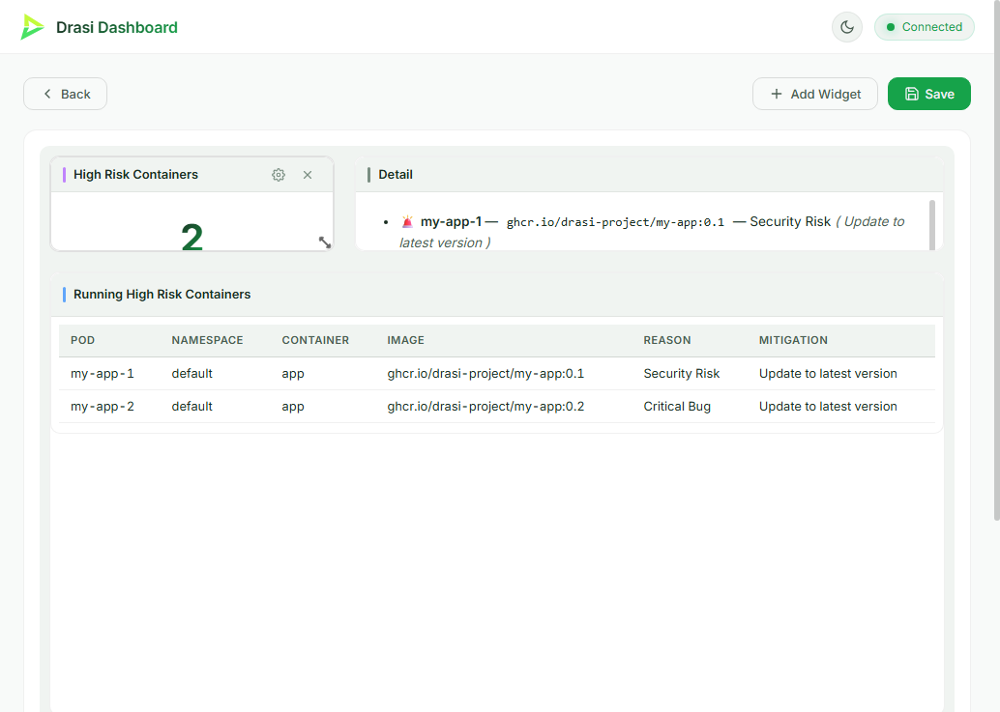

<!-- DO NOT EDIT. Generated from _index.md by scripts/render-tutorials.py. Edit _index.md and run `python3 scripts/render-tutorials.py`. -->

Imagine you keep a list of container images that are considered high risk — known vulnerabilities, compliance problems, images you simply don't want in production — and you want to know, the instant it happens, whenever one of them is actually *running* in your Kubernetes cluster. You don't want to write a controller, poll the API on a timer, or stand up a stream processor. You just want to describe the relationship between "risky images" and "running containers" and have something watch for the overlap, continuously.

This tutorial builds a **High Risk Containers** dashboard on **Drasi Server**. A PostgreSQL table holds the image tags you consider high risk, and a Kubernetes source watches the live Pods in a cluster. A single continuous query joins the two together, and Drasi Server's built-in **dashboard reaction** renders the result live — no application code and **no bespoke web UI**.

**What you'll build:** a running Drasi Server that connects to PostgreSQL *and* Kubernetes and reacts to both in real time, assembled from Drasi's three core building blocks:

**Sources** → **Continuous Queries** → **Reactions**

- **Sources** — Connect to your data sources
- **Continuous Queries** — Define what changes matter
- **Reactions** — Take action automatically

| Step | What You'll Do | Time |
| ---- | ------------- | ---- |
| **[Step 1: Set Up Your Environment](#step-1-of-4-set-up-your-environment)** | Open the dev container (or install the tools locally) | 5 min |
| **[Step 2: Run the Demo](#step-2-of-4-run-the-demo)** | One command starts Kubernetes, PostgreSQL, and Drasi Server | 5 min |
| **[Step 3: Open the Dashboard](#step-3-of-4-open-the-dashboard)** | Watch high risk containers appear live | 2 min |
| **[Step 4: Drive Change](#step-4-of-4-drive-change)** | Flag a new image and upgrade a Pod — and watch Drasi react instantly | 5 min |
| **[How It Works](#how-it-works)** | Understand the two sources, the unwind middleware, the synthetic join, and the dashboard | 5 min |

> **Before you begin**
>
> - **Terminals:** you'll use two. **Terminal 1** runs the demo (it stays in the foreground). Use **Terminal 2** for the helper scripts that change data.
> - **Working directory:** run every command from the tutorial directory (`tutorials/high-risk-containers/`). The dev container opens there automatically; if you're running locally, `cd tutorials/high-risk-containers` first.
> - **Command tabs:** commands are shown in tabs (*bash / zsh* and *PowerShell*) — use the one for your shell. The dev container and Codespaces use *bash*.
> - **Ports:** the Drasi Server API is on `8380`, the dashboard is on `3000`, PostgreSQL is published on `5732`, and the k3d Kubernetes API is on `6550`.

## Step 1 of 4: Set Up Your Environment
This tutorial needs **Docker** (it runs both PostgreSQL and a local Kubernetes cluster), plus **k3d** and **kubectl**. The easiest way to get everything is the **dev container**.

### Option A: Dev Container or GitHub Codespaces (recommended)

1. Open this repository in VS Code and run **Reopen in Container** (or create a **Codespace** from the repo's **Code** menu).
2. When prompted for a configuration, choose **Drasi Server - High Risk Containers Tutorial**.
3. Wait for the container to finish. Its setup script installs the PostgreSQL client, `kubectl`, and `k3d`, and downloads the Drasi Server binary.

That's it — skip ahead to [Step 2](#step-2-of-4-run-the-demo).

### Option B: Run Locally

You'll need **Docker** (for PostgreSQL and k3d), [**k3d**](https://k3d.io/#installation), [**kubectl**](https://kubernetes.io/docs/tasks/tools/), and **bash** (the helper scripts use it; on Windows use Git Bash or WSL, or use the PowerShell tabs). From the repository root, move into the tutorial directory and download the Drasi Server binary:

**bash / zsh**

```bash
cd tutorials/high-risk-containers
bash scripts/download.sh
```

**PowerShell**

```powershell
cd tutorials/high-risk-containers
powershell -ExecutionPolicy Bypass -File scripts/download.ps1
```

This places the binary at `bin/drasi-server` (or `bin\drasi-server.exe` on Windows) inside the tutorial directory.

## Step 2 of 4: Run the Demo
Everything runs from a single configuration file, `server-config.yaml`. In **Terminal 1**, start the demo:

**bash / zsh**

```bash
bash scripts/start-demo.sh
```

**PowerShell**

```powershell
powershell -ExecutionPolicy Bypass -File scripts/start-demo.ps1
```

The `start-demo` script does three things:

1. **Creates a k3d Kubernetes cluster** and deploys two demo Pods — `my-app-1` running `ghcr.io/drasi-project/my-app:0.1` and `my-app-2` running `:0.2` — then writes a kubeconfig that Drasi Server uses to watch the cluster.
2. **Starts PostgreSQL** and seeds the `RiskyImage` table (it flags `my-app:0.1` as a *Security Risk* and `redis:6.2.3-alpine` as a *Compliance Issue*).
3. **Runs Drasi Server** in the foreground with the full configuration.

On first start, Drasi Server downloads the plugins it needs (`source/postgres`, `bootstrap/postgres`, `source/kubernetes`, `bootstrap/kubernetes`, `reaction/dashboard`) from `ghcr.io/drasi-project` and caches them under `~/.drasi/plugins`, connects to both sources, bootstraps the existing rows and Pods, starts the continuous query, and starts the dashboard. When you see a line like the following, it's ready:

```text
Drasi Server started successfully with API on port 8380
```

Leave this running. Everything else happens from **Terminal 2** (or your browser).

> **Stopping and resetting**
>
> Press **Ctrl+C** in Terminal 1 to stop the server. To remove the database container *and* the k3d cluster when you're completely done, run `bash scripts/cleanup.sh` (bash) or `powershell -ExecutionPolicy Bypass -File scripts/cleanup.ps1` (PowerShell). Add `--volumes` (bash) or `-RemoveVolumes` (PowerShell) to also delete the database data.

## Step 3 of 4: Open the Dashboard
Drasi Server's dashboard reaction hosts a live web dashboard — there's no separate app to build or run. **Wait until Terminal 1 prints `Drasi Server started successfully`** (on the first run this takes a little longer while the plugins download), then open it in your browser:

```text
http://localhost:3000
```

In the dev container or Codespaces, port `3000` is forwarded automatically — VS Code shows a notification when the dashboard is ready, and you can also open it from the **Ports** panel (the **High Risk Containers Dashboard** entry). If you open the page before the server has finished starting, just refresh once it's ready.

You'll see the **High Risk Containers** dashboard:

- **High Risk Containers** KPI — how many running containers currently match a high risk image.
- **Running High Risk Containers** — the live table: pod, namespace, container, image, reason, and mitigation.
- **Detail** — a Markdown panel listing each finding (and an all-clear message when there are none).

To begin, exactly one container is flagged: **my-app-1**, running `my-app:0.1`, which the database lists as a *Security Risk*. The dashboard updates the instant the data changes — no refreshing. Let's make something change.




## Step 4 of 4: Drive Change
With Terminal 1 running the demo and the dashboard open, use **Terminal 2** to change the inputs and watch Drasi react.

### Flag a new high risk image

`my-app-2` is running `my-app:0.2`, but that image isn't risky *yet*. Add it to the `RiskyImage` table:

**bash / zsh**

```bash
bash scripts/add-risky-image.sh
```

**PowerShell**

```powershell
docker exec -i high-risk-containers-postgres psql -U drasi_user -d high_risk_containers -c "INSERT INTO \"RiskyImage\" (\"Id\", \"Image\", \"Reason\", \"Mitigation\") VALUES (101, 'ghcr.io/drasi-project/my-app:0.2', 'Critical Bug', 'Update to latest version');"
```

Within about a second the dashboard reacts: **my-app-2** appears in the table with reason *Critical Bug*, and the KPI ticks up to **2**. Nothing restarted, and Drasi never polled — it saw the new database row through PostgreSQL's logical replication and re-evaluated the join.

### Upgrade a Pod to a safe image

Now fix `my-app-2` by upgrading it to `:0.3`, which isn't on the risky list:

**bash / zsh**

```bash
bash scripts/upgrade-pod.sh
```

**PowerShell**

```powershell
kubectl --kubeconfig bin/kubeconfig.yaml set image pod/my-app-2 app=ghcr.io/drasi-project/my-app:0.3
```

Once the Pod is running the new image, **my-app-2** disappears from the table and the KPI drops back to **1** — Drasi saw the Pod change through the Kubernetes watch and removed the row from the result set automatically.

### Reset

Return everything to the starting state (removes the image you added and puts the Pods back on their original tags):

**bash / zsh**

```bash
bash scripts/reset.sh
```

**PowerShell**

```powershell
powershell -ExecutionPolicy Bypass -File scripts/reset.ps1
```

## How It Works
Everything you just ran is described by the single `server-config.yaml`. Here's what each part does.

### Two Sources

The query joins data from two different systems, so the configuration declares two sources.

**PostgreSQL** holds the list of risky images and streams changes via **logical replication (CDC)**:

```yaml
sources:
  - kind: postgres
    id: devops
    # ... connection settings ...
    tables:
      - RiskyImage
    tableKeys:
      - table: RiskyImage
        keyColumns:
          - Id
    bootstrapProvider:
      kind: postgres
```

The table name and columns are quoted and PascalCase (`"RiskyImage"`, `"Image"`, `"Reason"`, `"Mitigation"`) so the node label and properties Drasi sees match the Cypher query — `(i:RiskyImage)` with `i.Image`, `i.Reason`, `i.Mitigation` — without any change to the query text.

**Kubernetes** watches the live Pods. Drasi Server runs *outside* the cluster and connects with a kubeconfig file:

```yaml
  - kind: kubernetes
    id: k8s
    resources:
      - apiVersion: v1
        kind: Pod
    namespaces:
      - default
    authMode: kubeconfig
    kubeconfigPath: bin/kubeconfig.yaml
    bootstrapProvider:
      kind: kubernetes
```

The Kubernetes source flattens each Pod into graph-friendly properties. Alongside `name` and `namespace`, it exposes a `containers` list — one entry per container, each with its `name` and `image`. That list is the key to the join. (`scripts/setup-cluster.sh` writes the kubeconfig to `bin/kubeconfig.yaml`, and the start scripts launch Drasi Server from the tutorial directory so that relative path resolves.)

### The Unwind Middleware

The risky-image list is keyed by *image*, but a Pod can run several containers. To compare them, the query first **unwinds** each Pod's `containers` array, promoting every entry to its own `Container` node linked back to the Pod by an `OWNS` relation:

```yaml
middleware:
  - kind: unwind
    name: extract-containers
    config:
      Pod:
        - selector: $.containers[*]   # each entry in the Pod's containers list
          label: Container            # becomes a node with this label
          key: $.name                 # unique within the Pod
          relation: OWNS              # Pod -[:OWNS]-> Container
```

The middleware is attached to the Kubernetes subscription with a `pipeline`, so every incoming Pod change is pre-processed before the query sees it:

```yaml
sources:
  - sourceId: k8s
    nodes:
      - Pod
    pipeline:
      - extract-containers
  - sourceId: devops
    nodes:
      - RiskyImage
```

### The Synthetic Join

PostgreSQL and Kubernetes know nothing about each other, so the query **declares** the relationship that connects them. The `HAS_IMAGE` synthetic join matches a `Container`'s `image` to a `RiskyImage`'s `Image`:

```yaml
joins:
  - id: HAS_IMAGE
    keys:
      - label: Container
        property: image
      - label: RiskyImage
        property: Image
```

With the unwind relation and the synthetic join in place, the Cypher walks straight from Pod to Container to risky image and returns exactly the running containers that overlap the risky list:

```cypher
MATCH
  (p:Pod)-[:OWNS]->(c:Container)-[:HAS_IMAGE]->(i:RiskyImage)
RETURN
  p.name AS pod,
  p.namespace AS namespace,
  c.name AS container,
  c.image AS image,
  i.Reason AS reason,
  i.Mitigation AS mitigation
```

Because this is a *continuous* query, the result set is maintained incrementally: add a row to `RiskyImage` and a matching Pod appears; change a Pod's image and it drops out — each as a single change, with no rescans and no polling.

### The Dashboard Reaction

```yaml
reactions:
  - kind: dashboard
    id: high-risk-containers-dashboard
    queries:
      - high-risk-containers
    port: 3000
    predefinedDashboards:
      - id: high-risk-containers
        name: High Risk Containers
        widgets:
          # KPI (count), table, and a Markdown detail panel
          # ...
```

The dashboard reaction subscribes to the query and streams its changes to the browser over a WebSocket. A **predefined dashboard** is seeded on startup, so the layout is ready the first time you open it: a **KPI** counts the matching rows, a **table** lists them, and a **text** (Markdown) widget renders a human-friendly detail panel — or an all-clear message when the result set is empty. Because the query only emits *changes*, the dashboard updates the instant a Pod or the risky list changes. The full set of widget types and options is documented in [Configure the Dashboard Reaction](https://drasi.io/drasi-server/how-to-guides/configuration/configure-reactions/configure-dashboard-reaction/).

> **Inspect the query directly (optional)**
>
> You can also query Drasi Server's REST API while the demo runs — see `requests.http` for ready-made requests, for example:
>
> ```text
> GET http://localhost:8380/api/v1/queries/high-risk-containers/results
> ```

## Clean Up
When you're finished, stop Drasi Server with **Ctrl+C** in Terminal 1, then remove the database container and the k3d cluster:

**bash / zsh**

```bash
# Stop containers + cluster, keep data
bash scripts/cleanup.sh

# Stop containers + cluster and delete the database volume
bash scripts/cleanup.sh --volumes
```

**PowerShell**

```powershell
# Stop containers + cluster, keep data
powershell -ExecutionPolicy Bypass -File scripts/cleanup.ps1

# Stop containers + cluster and delete the database volume
powershell -ExecutionPolicy Bypass -File scripts/cleanup.ps1 -RemoveVolumes
```

## What You Learned
- **Multi-source queries** let Drasi join data that lives in completely different systems — here, a PostgreSQL table and a live Kubernetes cluster — with no glue code.
- The **unwind middleware** turns a nested array (a Pod's containers) into first-class graph nodes you can match and join.
- **Synthetic joins** declare relationships across sources, so a single Cypher query can walk from Pod to container to risky image.
- The **dashboard reaction** gave you a live, configurable UI with zero application code — no bespoke web app required.
- Because Drasi emits only what *changed*, the dashboard updates the instant a Pod or the risky-image list changes, with no polling.

From here, try watching more resource types, flagging your own images, adding columns to the query, or editing the dashboard widgets in `server-config.yaml`.
